# 분기 가시형 Langflow 플로우

이 문서는 현재 프로젝트에서 유지하는 Langflow 구조를 설명합니다.

지금 기준의 원칙은 단순합니다.

- 단일 통합 노드와 압축형 단계 노드는 제거
- LangGraph의 분기 구조를 눈에 보이게 하는 분해형 노드만 유지
- 멀티턴은 session memory와 merge node를 통해 연결

## 드러내고 싶은 분기

캔버스에 보이도록 유지하는 핵심 분기는 아래 3가지입니다.

- 후속 질문인지, 신규 조회인지
- 조회 계획 후 바로 종료인지, 단일 조회인지, 다중 조회인지
- 조회 후 바로 응답 가능한지, 추가 분석이 필요한지

## 현재 유지하는 핵심 노드

`custom_components/manufacturing_nodes/` 아래에서 분기형 구현에 필요한 노드는 아래와 같습니다.

- `manufacturing_session_memory.py`
- `extract_manufacturing_params.py`
- `decide_manufacturing_query_mode.py`
- `plan_manufacturing_datasets.py`
- `build_manufacturing_jobs.py`
- `route_manufacturing_query_mode.py`
- `route_manufacturing_retrieval_plan.py`
- `execute_manufacturing_jobs.py`
- `route_single_post_processing.py`
- `route_multi_post_processing.py`
- `build_single_retrieval_response.py`
- `run_single_retrieval_post_analysis.py`
- `build_multi_retrieval_response.py`
- `run_multi_retrieval_analysis.py`
- `run_manufacturing_followup.py`
- `merge_final_manufacturing_result.py`

## 추천 분기 구조

```mermaid
flowchart LR
  CI["Chat Input"]
  SL["Manufacturing Session Memory (load)"]
  EP["Extract Manufacturing Params"]
  QM["Decide Manufacturing Query Mode"]
  RQM{"Route Manufacturing Query Mode"}
  FU["Run Manufacturing Followup"]
  PD["Plan Manufacturing Datasets"]
  BJ["Build Manufacturing Jobs"]
  RRP{"Route Manufacturing Retrieval Plan"}
  ES["Execute Manufacturing Jobs (single)"]
  EM["Execute Manufacturing Jobs (multi)"]
  RSP{"Route Single Post Processing"}
  RMP{"Route Multi Post Processing"}
  BSD["Build Single Retrieval Response"]
  SSA["Run Single Retrieval Post Analysis"]
  BMO["Build Multi Retrieval Response"]
  MPA["Run Multi Retrieval Analysis"]
  MF["Merge Final Manufacturing Result"]

  CI -->|"message -> message"| SL
  SL -->|"session_state -> state"| EP
  EP -->|"state_with_params -> state"| QM
  QM -->|"state_with_mode -> state"| RQM
  RQM -->|"followup_state -> state"| FU
  FU -->|"followup_state -> followup_result"| MF
  RQM -->|"retrieval_state -> state"| PD
  PD -->|"state_with_plan -> state"| BJ
  BJ -->|"state_with_jobs -> state"| RRP
  RRP -->|"finish_state -> finish_result"| MF
  RRP -->|"single_state -> state"| ES
  ES -->|"state_with_source_results -> state"| RSP
  RSP -->|"direct_response_state -> state"| BSD
  BSD -->|"response_state -> single_direct_result"| MF
  RSP -->|"post_analysis_state -> state"| SSA
  SSA -->|"analysis_state -> single_analysis_result"| MF
  RRP -->|"multi_state -> state"| EM
  EM -->|"state_with_source_results -> state"| RMP
  RMP -->|"overview_state -> state"| BMO
  BMO -->|"response_state -> multi_overview_result"| MF
  RMP -->|"post_analysis_state -> state"| MPA
  MPA -->|"analysis_state -> multi_analysis_result"| MF
```

## 각 노드 역할

- `Chat Input`
  - 사용자 질문과 session id를 시작점으로 제공합니다.
- `Manufacturing Session Memory`
  - 이전 `chat_history`, `context`, `current_data`를 읽어 시작 state를 만듭니다.
- `Extract Manufacturing Params`
  - 날짜, 공정, 제품 등 조회 파라미터를 추출합니다.
- `Decide Manufacturing Query Mode`
  - follow-up인지 retrieval인지 판단합니다.
- `Route Manufacturing Query Mode`
  - 첫 번째 분기를 포트로 노출합니다.
- `Plan Manufacturing Datasets`
  - 어떤 데이터셋이 필요한지 계획합니다.
- `Build Manufacturing Jobs`
  - dataset key를 실제 retrieval job으로 구체화합니다.
- `Route Manufacturing Retrieval Plan`
  - 조기 종료, 단일 조회, 다중 조회 분기를 포트로 노출합니다.
- `Execute Manufacturing Jobs`
  - 실제 조회를 실행하고 `source_results`를 state에 붙입니다.
- `Route Single Post Processing`
  - 단일 조회 결과가 바로 응답 가능한지, 후처리가 필요한지 나눕니다.
- `Route Multi Post Processing`
  - 다중 조회 결과가 overview로 끝나는지, 추가 분석이 필요한지 나눕니다.
- `Build Single Retrieval Response`
  - 단일 조회의 직접 응답 결과를 만듭니다.
- `Run Single Retrieval Post Analysis`
  - 단일 조회 후 추가 분석 경로를 실행합니다.
- `Build Multi Retrieval Response`
  - 다중 조회의 overview 응답을 만듭니다.
- `Run Multi Retrieval Analysis`
  - 다중 조회 병합 및 분석 경로를 실행합니다.
- `Run Manufacturing Followup`
  - 현재 `current_data`를 기반으로 follow-up 분석을 수행합니다.
- `Merge Final Manufacturing Result`
  - 실제로 살아 있는 branch 결과 하나를 최종 payload로 합칩니다.

## 로직의 기준점

분기 기준은 여전히 LangGraph 쪽이 정본입니다.

- `manufacturing_agent/graph/builder.py`
  - `route_after_resolve`
  - `route_after_retrieval_plan`

후처리 분기는 Langflow에서도 재사용할 수 있도록 아래 서비스로 분리했습니다.

- `manufacturing_agent/services/runtime_service.py`

즉, Langflow만의 별도 규칙을 만든 것이 아니라 기존 비즈니스 로직을
재사용 가능한 단위로 나눠서 캔버스에 드러낸 구조입니다.

## 다음 문서

실제 Langflow 앱에서 노드를 어떤 순서로 놓고, 어떤 포트를 어디에 연결해야
하는지는 아래 문서를 보면 됩니다.

- `docs/07_LANGFLOW_CANVAS_SETUP.md`
