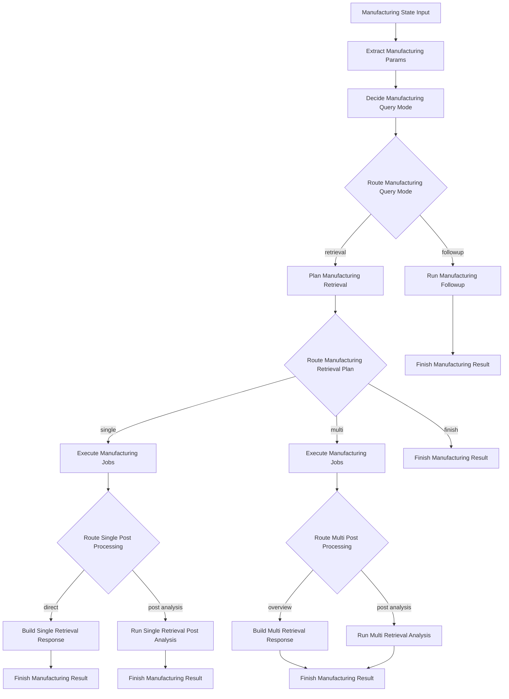

# 분기 가시형 Langflow 플로우

이 문서는 기존 LangGraph의 주요 분기 구조를 Langflow 캔버스에서도
눈에 보이게 표현하는 방법을 설명합니다.

목표는 단순합니다.

- LangGraph의 비즈니스 로직은 그대로 유지
- Langflow에서는 주요 분기점이 포트로 드러나게 구성
- 디버깅과 설명이 쉬운 캔버스 형태로 정리

## 드러내고 싶은 분기

이번 설계에서 캔버스에 보이도록 만든 분기는 아래 3가지입니다.

- 후속 질문인지, 신규 조회인지
- 조회 계획 후 바로 종료인지, 단일 조회인지, 다중 조회인지
- 조회 후 후처리가 필요한지, 바로 응답 가능한지

## 추가된 분기 노드

아래 노드들이 `custom_components/manufacturing_nodes/` 아래에 추가되었습니다.

- `route_manufacturing_query_mode.py`
- `route_manufacturing_retrieval_plan.py`
- `route_single_post_processing.py`
- `route_multi_post_processing.py`
- `build_single_retrieval_response.py`
- `run_single_retrieval_post_analysis.py`
- `build_multi_retrieval_response.py`
- `run_multi_retrieval_analysis.py`

## 추천 분기 구조

## 각 노드 역할

- `Manufacturing State Input`
  - 초기 state를 생성합니다.
- `Extract Manufacturing Params`
  - 날짜, 공정, 제품 등 조회 파라미터를 추출합니다.
- `Decide Manufacturing Query Mode`
  - follow-up인지 retrieval인지 판단합니다.
- `Route Manufacturing Query Mode`
  - LangGraph의 첫 번째 분기를 Langflow 포트로 노출합니다.
- `Plan Manufacturing Retrieval`
  - retrieval plan, dataset key, retrieval job을 준비합니다.
- `Route Manufacturing Retrieval Plan`
  - 조기 종료, 단일 조회, 다중 조회 분기를 포트로 노출합니다.
- `Execute Manufacturing Jobs`
  - 실제 조회를 실행하고 `source_results`를 state에 붙입니다.
- `Route Single Post Processing`
  - 단일 조회 결과가 바로 응답 가능한지, 후처리가 필요한지 나눕니다.
- `Route Multi Post Processing`
  - 다중 조회 결과가 overview로 끝나는지, 추가 분석이 필요한지 나눕니다.
- `Build Single Retrieval Response`
  - 단일 조회의 직접 응답 결과를 만듭니다.
- `Run Single Retrieval Post Analysis`
  - 단일 조회 후 추가 분석 경로를 실행합니다.
- `Build Multi Retrieval Response`
  - 다중 조회의 overview 응답을 만듭니다.
- `Run Multi Retrieval Analysis`
  - 다중 조회 병합 및 분석 경로를 실행합니다.
- `Finish Manufacturing Result`
  - 최종 state를 정리하고 `result` payload를 노출합니다.

## 로직의 기준점

첫 번째와 두 번째 분기 기준은 여전히 LangGraph 쪽이 정본입니다.

- `manufacturing_agent/graph/builder.py`
  - `route_after_resolve`
  - `route_after_retrieval_plan`

후처리 분기는 Langflow에서도 재사용할 수 있도록 아래 서비스로 분리했습니다.

- `manufacturing_agent/services/runtime_service.py`

즉, Langflow만의 별도 규칙을 만든 것이 아니라 기존 비즈니스 로직을
재사용 가능한 단위로 나눠서 캔버스에 드러낸 구조입니다.

## 다음 문서

실제 Langflow 앱에서 노드를 어떤 순서로 놓고, 어떤 포트를 어디에 연결해야
하는지는 아래 문서를 보면 됩니다.

- `docs/07_LANGFLOW_CANVAS_SETUP.md`
