# Langflow 캔버스 구성 가이드

이 문서는 Windows Langflow 앱에서 현재 유지 중인 분기 가시형 제조 에이전트 플로우를
직접 캔버스에 배치하고 연결하는 방법을 설명합니다.

핵심 목표는 아래와 같습니다.

- LangGraph와 같은 분기 흐름을 Langflow에서 눈으로 확인
- 포트 단위로 분기 배선을 명확히 구성
- 단일 통합 노드 없이도 멀티턴과 분기 테스트가 가능하도록 구성

## 시작 전 확인

- `custom_components/` 아래 파일을 수정했다면 Langflow를 완전히 재시작합니다.
- `LANGFLOW_COMPONENTS_PATH`가 아래 경로를 가리키는지 확인합니다.
  - `C:\Users\qkekt\Desktop\langflow_local_manufacturing_project\custom_components`
- Langflow가 이 프로젝트와 의존성 패키지를 import할 수 있어야 합니다.
- Langflow 검색창에서는 아래에 적힌 `display_name` 기준으로 노드를 찾으면 됩니다.

## 추천 캔버스 구조

```mermaid
flowchart LR
  CI["Chat Input"]
  SL["Manufacturing Session Memory (load)"]
  EP["Extract Manufacturing Params"]
  QM["Decide Manufacturing Query Mode"]
  RQM{"Route Manufacturing Query Mode"}

  FU["Run Manufacturing Followup"]

  PD["Plan Manufacturing Datasets"]
  BJ["Build Manufacturing Jobs"]
  RRP{"Route Manufacturing Retrieval Plan"}

  ES["Execute Manufacturing Jobs (single)"]
  RSP{"Route Single Post Processing"}
  BSD["Build Single Retrieval Response"]
  SSA["Run Single Retrieval Post Analysis"]

  EM["Execute Manufacturing Jobs (multi)"]
  RMP{"Route Multi Post Processing"}
  BMO["Build Multi Retrieval Response"]
  MPA["Run Multi Retrieval Analysis"]

  MF["Merge Final Manufacturing Result"]
  SS["Manufacturing Session Memory (save)"]
  CO["Chat Output"]

  CI -->|"message -> message"| SL
  SL -->|"session_state -> state"| EP
  EP -->|"state_with_params -> state"| QM
  QM -->|"state_with_mode -> state"| RQM

  RQM -->|"followup_state -> state"| FU
  FU -->|"followup_state -> followup_result"| MF

  RQM -->|"retrieval_state -> state"| PD
  PD -->|"state_with_plan -> state"| BJ
  BJ -->|"state_with_jobs -> state"| RRP
  RRP -->|"finish_state -> finish_result"| MF

  RRP -->|"single_state -> state"| ES
  ES -->|"state_with_source_results -> state"| RSP
  RSP -->|"direct_response_state -> state"| BSD
  BSD -->|"response_state -> single_direct_result"| MF
  RSP -->|"post_analysis_state -> state"| SSA
  SSA -->|"analysis_state -> single_analysis_result"| MF

  RRP -->|"multi_state -> state"| EM
  EM -->|"state_with_source_results -> state"| RMP
  RMP -->|"overview_state -> state"| BMO
  BMO -->|"response_state -> multi_overview_result"| MF
  RMP -->|"post_analysis_state -> state"| MPA
  MPA -->|"analysis_state -> multi_analysis_result"| MF

  MF -->|"merged_result -> result"| SS
  CI -->|"message -> message"| SS
  SS -->|"saved_result -> input_value"| CO
```

## 캔버스에 놓는 순서

1. `Chat Input`
2. `Manufacturing Session Memory`
3. `Extract Manufacturing Params`
4. `Decide Manufacturing Query Mode`
5. `Route Manufacturing Query Mode`
6. `Run Manufacturing Followup`
7. `Plan Manufacturing Datasets`
8. `Build Manufacturing Jobs`
9. `Route Manufacturing Retrieval Plan`
10. `Execute Manufacturing Jobs`
11. `Route Single Post Processing`
12. `Build Single Retrieval Response`
13. `Run Single Retrieval Post Analysis`
14. `Execute Manufacturing Jobs`
15. `Route Multi Post Processing`
16. `Build Multi Retrieval Response`
17. `Run Multi Retrieval Analysis`
18. `Merge Final Manufacturing Result`

중복 배치가 있는 이유는 의도적입니다.

- 단일 조회 lane용 `Execute Manufacturing Jobs`
- 다중 조회 lane용 `Execute Manufacturing Jobs`

이렇게 분리해 두면 캔버스 가독성이 훨씬 좋아집니다.

## 추천 배치 방식

열 기준으로 보면 아래처럼 두면 읽기 편합니다.

- 1열
  - `Chat Input`
- 2열
  - `Manufacturing Session Memory`
  - `Extract Manufacturing Params`
- 3열
  - `Decide Manufacturing Query Mode`
  - `Route Manufacturing Query Mode`
- 4열
  - 상단: `Run Manufacturing Followup`
  - 중앙: `Plan Manufacturing Datasets`
  - 하단: `Build Manufacturing Jobs`
  - 그 아래: `Route Manufacturing Retrieval Plan`
- 5열
  - 단일 조회 lane: `Execute Manufacturing Jobs` -> `Route Single Post Processing`
  - 다중 조회 lane: `Execute Manufacturing Jobs` -> `Route Multi Post Processing`
- 6열
  - 단일 직접응답 lane: `Build Single Retrieval Response`
  - 단일 분석 lane: `Run Single Retrieval Post Analysis`
  - 다중 overview lane: `Build Multi Retrieval Response`
  - 다중 분석 lane: `Run Multi Retrieval Analysis`
- 7열
  - `Merge Final Manufacturing Result`

## 정확한 포트 연결표

- `Chat Input.message` -> `Manufacturing Session Memory.message`
- `Manufacturing Session Memory.session_state` -> `Extract Manufacturing Params.state`
- `Extract Manufacturing Params.state_with_params` -> `Decide Manufacturing Query Mode.state`
- `Decide Manufacturing Query Mode.state_with_mode` -> `Route Manufacturing Query Mode.state`

- `Route Manufacturing Query Mode.followup_state` -> `Run Manufacturing Followup.state`
- `Run Manufacturing Followup.followup_state` -> `Merge Final Manufacturing Result.followup_result`

- `Route Manufacturing Query Mode.retrieval_state` -> `Plan Manufacturing Datasets.state`
- `Plan Manufacturing Datasets.state_with_plan` -> `Build Manufacturing Jobs.state`
- `Build Manufacturing Jobs.state_with_jobs` -> `Route Manufacturing Retrieval Plan.state`

- `Route Manufacturing Retrieval Plan.finish_state` -> `Merge Final Manufacturing Result.finish_result`

- `Route Manufacturing Retrieval Plan.single_state` -> `Execute Manufacturing Jobs.state`
- `Execute Manufacturing Jobs.state_with_source_results` -> `Route Single Post Processing.state`
- `Route Single Post Processing.direct_response_state` -> `Build Single Retrieval Response.state`
- `Build Single Retrieval Response.response_state` -> `Merge Final Manufacturing Result.single_direct_result`
- `Route Single Post Processing.post_analysis_state` -> `Run Single Retrieval Post Analysis.state`
- `Run Single Retrieval Post Analysis.analysis_state` -> `Merge Final Manufacturing Result.single_analysis_result`

- `Route Manufacturing Retrieval Plan.multi_state` -> 두 번째 `Execute Manufacturing Jobs.state`
- 두 번째 `Execute Manufacturing Jobs.state_with_source_results` -> `Route Multi Post Processing.state`
- `Route Multi Post Processing.overview_state` -> `Build Multi Retrieval Response.state`
- `Build Multi Retrieval Response.response_state` -> `Merge Final Manufacturing Result.multi_overview_result`
- `Route Multi Post Processing.post_analysis_state` -> `Run Multi Retrieval Analysis.state`
- `Run Multi Retrieval Analysis.analysis_state` -> `Merge Final Manufacturing Result.multi_analysis_result`

## 각 branch 의미

- `followup_state`
  - `current_data`를 기반으로 후속 분석을 하는 질문입니다.
- `finish_state`
  - planning 단계에서 이미 최종 `result`가 만들어진 상태입니다.
  - 보통 날짜 누락, dataset 미확정 같은 경우입니다.
- `single_state`
  - retrieval job이 1개인 경우입니다.
- `multi_state`
  - retrieval job이 2개 이상인 경우입니다.
- `direct_response_state`
  - 단일 조회 결과를 추가 분석 없이 바로 응답할 수 있는 경우입니다.
- 단일 lane의 `post_analysis_state`
  - 단일 조회 후 추가 분석이 필요한 경우입니다.
- `overview_state`
  - 다중 조회 결과를 overview 형태로 바로 응답하는 경우입니다.
- 다중 lane의 `post_analysis_state`
  - 다중 조회 결과를 병합/분석까지 이어가야 하는 경우입니다.

## 첫 실행 입력 예시

처음 질문은 `Chat Input`에 넣고, 앞쪽 `Manufacturing Session Memory`가 빈 세션 기준으로
초기 state를 만듭니다.

- `Chat Input.message`
  - `어제 D/A3 생산 보여줘`
- `session_id`
  - 새 대화라면 임의의 새 값

## 후속 질문 입력 예시

후속 질문은 같은 `session_id`를 유지한 채 `Chat Input`에 다음 질문만 넣으면 됩니다.

- `Chat Input.message`
  - `공정별 평균도 같이 보여줘`
- `session_id`
  - 이전 턴과 동일

## 어떤 출력을 보면 되는지

최종 결과는 `Merge Final Manufacturing Result.merged_result`에서 확인하면 됩니다.

## 추천 테스트 순서

아래 3가지를 순서대로 확인해보면 분기가 제대로 보입니다.

1. dataset 하나만 필요한 신규 조회 질문 실행
2. dataset 여러 개가 필요한 신규 조회 질문 실행
3. 같은 `session_id`를 유지한 뒤 후속 분석 질문 실행

배선이 맞으면 눈으로 아래 흐름을 확인할 수 있습니다.

- query mode router가 `followup_state`와 `retrieval_state` 중 하나를 탑니다.
- retrieval plan router가 `finish_state`, `single_state`, `multi_state` 중 하나를 탑니다.
- post-processing router가 direct/overview와 analysis branch 중 하나를 탑니다.

## 실무 팁

- branch lane마다 색을 다르게 두면 캔버스가 훨씬 읽기 쉬워집니다.
- `Execute Manufacturing Jobs`는 같은 컴포넌트여도 single/multi lane을 분리해서 두는 편이 좋습니다.
- 코드 변경 후 노드가 안 보이면 Langflow 데스크톱 앱을 완전히 종료 후 재실행합니다.
- 노드는 보이는데 로딩이 실패하면 Langflow 런타임의 Python 의존성 문제일 가능성이 가장 큽니다.
