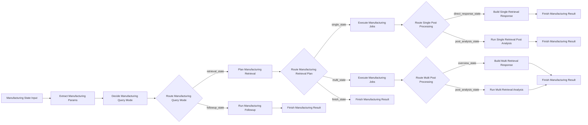

# Langflow 캔버스 구성 가이드

이 문서는 Windows Langflow 앱에서 분기 가시형 제조 에이전트 플로우를
직접 캔버스에 배치하고 연결하는 방법을 설명합니다.

핵심 목표는 아래와 같습니다.

- LangGraph와 같은 분기 흐름을 Langflow에서 눈으로 확인
- 포트 단위로 분기 배선을 명확히 구성
- 신규 조회, 후속 질문, 후처리 분기까지 실제로 테스트 가능하게 구성

## 시작 전 확인

- `custom_components/` 아래 파일을 수정했다면 Langflow를 완전히 재시작합니다.
- `LANGFLOW_COMPONENTS_PATH`가 아래 경로를 가리키는지 확인합니다.
  - `C:\Users\qkekt\Desktop\langflow_local_manufacturing_project\custom_components`
- Langflow가 이 프로젝트와 의존성 패키지를 import할 수 있어야 합니다.
- Langflow 검색창에서는 아래에 적힌 `display_name` 기준으로 노드를 찾으면 됩니다.

## 추천 캔버스 구조

전체 구조는 왼쪽에서 오른쪽으로 흐르는 공통 trunk와, 중간에서 갈라지는
여러 branch lane으로 보면 이해하기 쉽습니다.

## 캔버스에 놓는 순서

아래 순서대로 노드를 추가하면 배치가 가장 자연스럽습니다.

1. `Manufacturing State Input`
2. `Extract Manufacturing Params`
3. `Decide Manufacturing Query Mode`
4. `Route Manufacturing Query Mode`
5. `Run Manufacturing Followup`
6. `Plan Manufacturing Retrieval`
7. `Route Manufacturing Retrieval Plan`
8. `Execute Manufacturing Jobs`
9. `Route Single Post Processing`
10. `Build Single Retrieval Response`
11. `Run Single Retrieval Post Analysis`
12. `Execute Manufacturing Jobs`
13. `Route Multi Post Processing`
14. `Build Multi Retrieval Response`
15. `Run Multi Retrieval Analysis`
16. `Finish Manufacturing Result`
17. `Finish Manufacturing Result`
18. `Finish Manufacturing Result`
19. `Finish Manufacturing Result`
20. `Finish Manufacturing Result`

중복 배치가 있는 이유는 의도적입니다.

- 단일 조회 lane용 `Execute Manufacturing Jobs`
- 다중 조회 lane용 `Execute Manufacturing Jobs`
- 각 branch 끝을 분명히 보여주기 위한 `Finish Manufacturing Result`

이렇게 분리해 두면 캔버스 가독성이 훨씬 좋아집니다.

## 추천 배치 방식

열 기준으로 보면 아래처럼 두면 읽기 편합니다.

- 1열
  - `Manufacturing State Input`
- 2열
  - `Extract Manufacturing Params`
- 3열
  - `Decide Manufacturing Query Mode`
  - `Route Manufacturing Query Mode`
- 4열
  - 상단: `Run Manufacturing Followup`
  - 중앙: `Plan Manufacturing Retrieval`
  - 그 아래: `Route Manufacturing Retrieval Plan`
- 5열
  - 단일 조회 lane: `Execute Manufacturing Jobs` -> `Route Single Post Processing`
  - 다중 조회 lane: `Execute Manufacturing Jobs` -> `Route Multi Post Processing`
- 6열
  - 단일 직접응답 lane: `Build Single Retrieval Response`
  - 단일 분석 lane: `Run Single Retrieval Post Analysis`
  - 다중 overview lane: `Build Multi Retrieval Response`
  - 다중 분석 lane: `Run Multi Retrieval Analysis`
- 7열
  - 각 분기 끝마다 `Finish Manufacturing Result`

가장 읽기 쉬운 화면 배치는 아래 순서입니다.

- 최상단: follow-up branch
- 그 아래: early finish branch
- 그 아래: single retrieval branch
- 최하단: multi retrieval branch

## 정확한 포트 연결표

아래 포트 이름 그대로 연결하면 됩니다.

- `Manufacturing State Input.initial_state` -> `Extract Manufacturing Params.state`
- `Extract Manufacturing Params.state_with_params` -> `Decide Manufacturing Query Mode.state`
- `Decide Manufacturing Query Mode.state_with_mode` -> `Route Manufacturing Query Mode.state`

- `Route Manufacturing Query Mode.followup_state` -> `Run Manufacturing Followup.state`
- `Run Manufacturing Followup.followup_state` -> `Finish Manufacturing Result.state`

- `Route Manufacturing Query Mode.retrieval_state` -> `Plan Manufacturing Retrieval.state`
- `Plan Manufacturing Retrieval.planned_state` -> `Route Manufacturing Retrieval Plan.state`

- `Route Manufacturing Retrieval Plan.finish_state` -> `Finish Manufacturing Result.state`

- `Route Manufacturing Retrieval Plan.single_state` -> `Execute Manufacturing Jobs.state`
- `Execute Manufacturing Jobs.state_with_source_results` -> `Route Single Post Processing.state`
- `Route Single Post Processing.direct_response_state` -> `Build Single Retrieval Response.state`
- `Build Single Retrieval Response.response_state` -> `Finish Manufacturing Result.state`
- `Route Single Post Processing.post_analysis_state` -> `Run Single Retrieval Post Analysis.state`
- `Run Single Retrieval Post Analysis.analysis_state` -> `Finish Manufacturing Result.state`

- `Route Manufacturing Retrieval Plan.multi_state` -> `Execute Manufacturing Jobs.state`
- `Execute Manufacturing Jobs.state_with_source_results` -> `Route Multi Post Processing.state`
- `Route Multi Post Processing.overview_state` -> `Build Multi Retrieval Response.state`
- `Build Multi Retrieval Response.response_state` -> `Finish Manufacturing Result.state`
- `Route Multi Post Processing.post_analysis_state` -> `Run Multi Retrieval Analysis.state`
- `Run Multi Retrieval Analysis.analysis_state` -> `Finish Manufacturing Result.state`

## 각 branch 의미

- `followup_state`
  - `current_data`를 기반으로 후속 분석을 하는 질문입니다.
- `finish_state`
  - retrieval planning 단계에서 이미 최종 `result`가 만들어진 상태입니다.
  - 보통 날짜 누락, dataset 미확정 같은 경우입니다.
- `single_state`
  - retrieval job이 1개인 경우입니다.
- `multi_state`
  - retrieval job이 2개 이상인 경우입니다.
- `direct_response_state`
  - 단일 조회 결과를 추가 분석 없이 바로 응답할 수 있는 경우입니다.
- 단일 lane의 `post_analysis_state`
  - 단일 조회 후 추가 분석이 필요한 경우입니다.
- `overview_state`
  - 다중 조회 결과를 overview 형태로 바로 응답하는 경우입니다.
- 다중 lane의 `post_analysis_state`
  - 다중 조회 결과를 병합/분석까지 이어가야 하는 경우입니다.

## 첫 실행 입력 예시

처음 질문을 넣을 때 `Manufacturing State Input`에 아래처럼 넣으면 됩니다.

- `User Input`
  - `어제 D/A3 생산 보여줘`
- `Chat History JSON`
  - `[]`
- `Context JSON`
  - `{}`
- `Current Data JSON`
  - 비워두거나 `null`

## 후속 질문 입력 예시

후속 질문을 테스트할 때는 직전 결과를 다시 넣어야 합니다.

- `User Input`
  - `공정별 평균도 같이 보여줘`
- `Chat History JSON`
  - 이전 user/assistant 대화를 JSON 배열로 입력
- `Context JSON`
  - 외부에서 누적한 filter/context가 있으면 같이 입력
- `Current Data JSON`
  - 직전 branch 결과의 `result.current_data`를 입력

`Current Data JSON`이 비어 있으면, follow-up으로 가야 할 질문도 retrieval branch로
돌아갈 가능성이 높습니다.

## 어떤 출력을 보면 되는지

각 `Finish Manufacturing Result` 노드에는 두 출력이 있습니다.

- `finished_state`
  - 뒤에서 state를 더 이어서 쓰고 싶을 때 사용
- `result`
  - 최종 payload를 보고 싶을 때 사용

일반적인 Langflow 테스트에서는 `result`를 확인하는 쪽이 가장 편합니다.

## 추천 테스트 순서

아래 3가지를 순서대로 확인해보면 분기가 제대로 보입니다.

1. dataset 하나만 필요한 신규 조회 질문 실행
2. dataset 여러 개가 필요한 신규 조회 질문 실행
3. `Current Data JSON`을 채운 뒤 후속 분석 질문 실행

배선이 맞으면 눈으로 아래 흐름을 확인할 수 있습니다.

- query mode router가 `followup_state`와 `retrieval_state` 중 하나를 탑니다.
- retrieval plan router가 `finish_state`, `single_state`, `multi_state` 중 하나를 탑니다.
- post-processing router가 direct/overview와 analysis branch 중 하나를 탑니다.

## 실무 팁

- branch lane마다 색을 다르게 두면 캔버스가 훨씬 읽기 쉬워집니다.
- `Execute Manufacturing Jobs`는 같은 컴포넌트여도 single/multi lane을 분리해서 두는 편이 좋습니다.
- 모든 `Finish Manufacturing Result`는 맨 오른쪽 끝에 두면 branch가 깔끔하게 정리됩니다.
- 코드 변경 후 노드가 안 보이면 Langflow 데스크톱 앱을 완전히 종료 후 재실행합니다.
- 노드는 보이는데 로딩이 실패하면 Langflow 런타임의 Python 의존성 문제일 가능성이 가장 큽니다.
