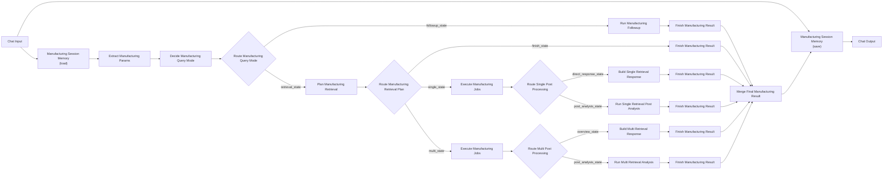

# 멀티턴 챗봇형 Langflow 플로우

이 문서는 분해형 제조 에이전트 플로우를 `Playground`에서 바로 사용할 수 있는
멀티턴 챗봇형 구조로 연결하는 방법을 설명합니다.

핵심 추가 노드는 2개입니다.

- `Manufacturing Session Memory`
- `Merge Final Manufacturing Result`

여기서 `Manufacturing Session Memory`는 같은 컴포넌트를 캔버스에 2번 올려서 씁니다.

- 앞쪽 인스턴스: 이전 대화 상태 불러오기
- 뒤쪽 인스턴스: 이번 턴 결과 저장하기

## 전체 구조

## 노드 배치 순서

1. `Chat Input`
2. `Manufacturing Session Memory`
3. `Extract Manufacturing Params`
4. `Decide Manufacturing Query Mode`
5. `Route Manufacturing Query Mode`
6. `Run Manufacturing Followup`
7. `Plan Manufacturing Retrieval`
8. `Route Manufacturing Retrieval Plan`
9. `Execute Manufacturing Jobs`
10. `Route Single Post Processing`
11. `Build Single Retrieval Response`
12. `Run Single Retrieval Post Analysis`
13. `Execute Manufacturing Jobs`
14. `Route Multi Post Processing`
15. `Build Multi Retrieval Response`
16. `Run Multi Retrieval Analysis`
17. `Finish Manufacturing Result`
18. `Finish Manufacturing Result`
19. `Finish Manufacturing Result`
20. `Finish Manufacturing Result`
21. `Finish Manufacturing Result`
22. `Finish Manufacturing Result`
23. `Merge Final Manufacturing Result`
24. `Manufacturing Session Memory`
25. `Chat Output`

## 정확한 연결

- `Chat Input.message` -> `Manufacturing Session Memory.message`
- `Manufacturing Session Memory.session_state` -> `Extract Manufacturing Params.state`
- `Extract Manufacturing Params.state_with_params` -> `Decide Manufacturing Query Mode.state`
- `Decide Manufacturing Query Mode.state_with_mode` -> `Route Manufacturing Query Mode.state`

- `Route Manufacturing Query Mode.followup_state` -> `Run Manufacturing Followup.state`
- `Run Manufacturing Followup.followup_state` -> `Finish Manufacturing Result.state`
- 첫 번째 `Finish Manufacturing Result.result` -> `Merge Final Manufacturing Result.followup_result`

- `Route Manufacturing Query Mode.retrieval_state` -> `Plan Manufacturing Retrieval.state`
- `Plan Manufacturing Retrieval.planned_state` -> `Route Manufacturing Retrieval Plan.state`

- `Route Manufacturing Retrieval Plan.finish_state` -> 두 번째 `Finish Manufacturing Result.state`
- 두 번째 `Finish Manufacturing Result.result` -> `Merge Final Manufacturing Result.finish_result`

- `Route Manufacturing Retrieval Plan.single_state` -> `Execute Manufacturing Jobs.state`
- `Execute Manufacturing Jobs.state_with_source_results` -> `Route Single Post Processing.state`
- `Route Single Post Processing.direct_response_state` -> `Build Single Retrieval Response.state`
- `Build Single Retrieval Response.response_state` -> 세 번째 `Finish Manufacturing Result.state`
- 세 번째 `Finish Manufacturing Result.result` -> `Merge Final Manufacturing Result.single_direct_result`
- `Route Single Post Processing.post_analysis_state` -> `Run Single Retrieval Post Analysis.state`
- `Run Single Retrieval Post Analysis.analysis_state` -> 네 번째 `Finish Manufacturing Result.state`
- 네 번째 `Finish Manufacturing Result.result` -> `Merge Final Manufacturing Result.single_analysis_result`

- `Route Manufacturing Retrieval Plan.multi_state` -> 두 번째 `Execute Manufacturing Jobs.state`
- 두 번째 `Execute Manufacturing Jobs.state_with_source_results` -> `Route Multi Post Processing.state`
- `Route Multi Post Processing.overview_state` -> `Build Multi Retrieval Response.state`
- `Build Multi Retrieval Response.response_state` -> 다섯 번째 `Finish Manufacturing Result.state`
- 다섯 번째 `Finish Manufacturing Result.result` -> `Merge Final Manufacturing Result.multi_overview_result`
- `Route Multi Post Processing.post_analysis_state` -> `Run Multi Retrieval Analysis.state`
- `Run Multi Retrieval Analysis.analysis_state` -> 여섯 번째 `Finish Manufacturing Result.state`
- 여섯 번째 `Finish Manufacturing Result.result` -> `Merge Final Manufacturing Result.multi_analysis_result`

- `Merge Final Manufacturing Result.merged_result` -> 뒤쪽 `Manufacturing Session Memory.result`
- `Chat Input.message` -> 뒤쪽 `Manufacturing Session Memory.message`
- 뒤쪽 `Manufacturing Session Memory.saved_result` -> `Chat Output.input_value`

## 각 추가 노드의 역할

### `Manufacturing Session Memory`

앞쪽 인스턴스는 이전 턴에서 저장해 둔 값을 읽어서 새 질문용 state를 만듭니다.

- `chat_history`
- `context`
- `current_data`

뒤쪽 인스턴스는 이번 턴의 최종 결과를 저장합니다.

- 사용자 질문을 `chat_history`에 추가
- 최종 `response`를 assistant 메시지로 추가
- `extracted_params`를 `context`로 저장
- `current_data`를 다음 턴용 테이블로 저장

기본 저장 위치는 프로젝트 루트 아래의:

- `.langflow_session_store/`

입니다.

### `Merge Final Manufacturing Result`

분해형 branch에서 최종적으로 살아 있는 결과는 항상 하나뿐입니다.
이 노드는 여러 `Finish Manufacturing Result.result` 입력 중 실제 값이 있는 하나를 골라
단일 result payload로 합칩니다.

## `Chat Output` 설정

`Chat Output`의 고급 설정에서:

- `Data Template` = `{response}`

로 두면 최종 payload 안의 `response`만 챗 메시지로 보여줄 수 있습니다.

## 실행 방식

이제는 분해형 플로우라도 `Playground`에서 한 번에 실행할 수 있습니다.

흐름은 아래처럼 됩니다.

1. `Chat Input`에서 사용자가 질문
2. 앞쪽 `Manufacturing Session Memory`가 이전 턴 상태 복원
3. 분해형 branch flow 자동 실행
4. `Merge Final Manufacturing Result`가 실제 branch 결과 하나 선택
5. 뒤쪽 `Manufacturing Session Memory`가 이번 턴 결과 저장
6. `Chat Output`이 `response`를 표시

## 주의사항

- `Manufacturing State Input`은 이 챗봇형 플로우에선 보통 쓰지 않습니다.
  - 그 역할을 앞쪽 `Manufacturing Session Memory`가 대신합니다.
- 세션을 새로 시작하고 싶으면 `Chat Input`의 다른 `session_id`를 쓰거나,
  저장 폴더의 해당 JSON 파일을 지우면 됩니다.
- 기존 branch-visible 디버그 플로우는 그대로 두고,
  운영용으로 이 멀티턴 챗봇형 플로우를 별도로 만드는 것을 권장합니다.
