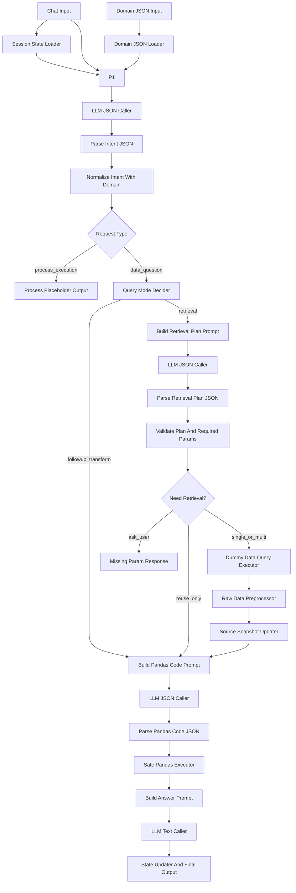
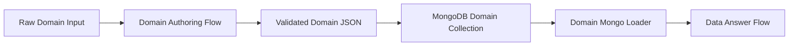

# Langflow Stand Alone Implementation Plan

이 문서는 제조 데이터 분석 Agent를 Langflow에서 새롭게 구현하기 위한 설계 문서이다.

기존 LangGraph 구조의 의도는 참고하되, Langflow 버전은 기존 Python 모듈을 import해서 재사용하지 않는다. 각 Custom Component는 Stand Alone 방식으로 동작해야 하며, Langflow 화면에서 노드 역할과 연결 순서가 명확하게 보이는 구조를 목표로 한다.

## 1. 목표

Phase 1의 목표는 사용자 질문에 대한 제조 데이터 조회 및 분석 답변 기능이다.

구현해야 하는 핵심 기능은 다음과 같다.

- 사용자 질문에서 데이터 조회 의도, 필수 조회 파라미터, 필터, 그룹화, 정렬, 계산 의도를 추출한다.
- 도메인 정보는 JSON Input으로 받는다.
- 데이터 조회는 Phase 1에서 더미 데이터를 사용한다.
- 데이터마다 필수 조회 파라미터가 있을 수 있고 없을 수도 있다.
- 필수 조회 파라미터는 고정 쿼리 템플릿에 들어가는 변수로 취급한다.
- 필수 조회 파라미터가 바뀌면 신규 데이터 조회가 필요하다.
- 필수 조회 파라미터가 같고 후처리 필터만 바뀌면 기존 원본 데이터를 재사용한다.
- 원본 데이터 조회 이후 표준 전처리를 수행한다.
- 사용자 질문, 도메인 지식, 컬럼 정보를 바탕으로 LLM이 pandas 전처리 코드를 생성한다.
- 생성된 pandas 코드는 제한된 실행 환경에서 실행한다.
- 전처리된 결과를 바탕으로 최종 답변을 생성한다.
- 이전 턴의 상태를 유지하여 연속 분석을 지원한다.
- 생산 달성율처럼 여러 데이터셋이 필요한 계산은 도메인 지식에 정의된 필요 데이터셋을 사용하여 다중 조회 후 분석한다.
- 추후 process 기반 end-to-end 기능을 붙일 수 있도록 최초 라우팅 단계에서 `data_question`과 `process_execution`을 구분한다.

## 2. 설계 원칙

### 2.1 Stand Alone 원칙

Langflow Custom Component는 다른 프로젝트 파일을 import하지 않는다.

허용되는 의존성은 다음 수준으로 제한한다.

- Python standard library
- pandas
- Langflow component base class와 input/output 타입
- LLM API 호출에 필요한 최소 라이브러리 또는 Langflow 기본 LLM 노드

금지되는 방식은 다음과 같다.

- `manufacturing_agent` 패키지 import
- 기존 LangGraph node 함수 import
- 기존 domain registry 함수 import
- 기존 retrieval 함수 import
- 공통 helper 파일을 외부에서 import하는 구조

각 노드는 필요한 helper 함수를 자기 파일 내부에 작게 포함한다. 단, 중복을 줄이기 위해 노드 간에 전달하는 payload key는 표준화한다.

### 2.2 쉬운 유지보수 원칙

한 노드가 너무 많은 일을 하지 않도록 한다.

특히 LLM 호출은 다음처럼 분리한다.

- Prompt 생성 노드
- LLM 호출 노드
- JSON 파싱 및 검증 노드
- deterministic 보정 노드

예를 들어 질문 이해 기능도 하나의 거대한 노드로 만들지 않고 다음처럼 나눈다.

- `BuildIntentPrompt`
- `LLMJsonCaller`
- `ParseIntentJson`
- `NormalizeIntentWithDomain`

이렇게 구성하면 Python 초보자와 Langflow 입문자도 canvas에서 각 단계의 역할을 이해하기 쉽다.

### 2.3 필수 파라미터와 후처리 필터 분리

가장 중요한 설계 기준이다.

- 필수 파라미터: 원본 데이터를 조회하기 위해 쿼리 템플릿에 반드시 들어가는 값
- 후처리 필터: 조회된 원본 데이터에서 pandas로 거르는 조건

예시:

- 생산 데이터의 필수 파라미터가 `date`라면 `오늘 A제품 생산량`은 `date=오늘`로 원본 데이터를 조회한 뒤 `product=A`는 pandas 후처리 필터로 적용한다.
- 후속 질문이 `오늘 B제품 생산량`이면 `date`가 그대로이므로 신규 조회 없이 기존 `date=오늘` 원본 데이터에서 `product=B` 필터만 다시 적용한다.
- 후속 질문이 `어제 생산량`이면 필수 파라미터인 `date`가 바뀌므로 신규 조회가 필요하다.

이 구분이 무너지면 연속 분석 기능이 제대로 동작하지 않는다.

### 2.4 원본 데이터 보존 원칙

후속 질문을 처리하려면 최종 결과 테이블만 저장하면 안 된다.

상태에는 반드시 다음을 보존한다.

- 현재 원본 데이터 snapshot
- 각 원본 데이터의 dataset key
- 각 원본 데이터 조회에 사용된 필수 파라미터
- 현재 결과 테이블
- 현재 결과 테이블에 적용된 후처리 필터
- 대화 context
- chat history

## 3. 전체 Flow 개요

Phase 1 Langflow canvas는 크게 5개 구간으로 나눈다.

1. 입력 준비
2. 질문 이해 및 라우팅
3. 데이터 조회 계획 및 실행
4. pandas 기반 전처리 및 분석
5. 답변 생성 및 상태 저장

전체 Langflow 구성은 장기적으로 두 개의 flow로 분리한다.

- `Domain Authoring Flow`: 사용자가 입력한 줄글/표/JSON 형태의 도메인 설명을 LLM이 표준 Domain JSON으로 정리하고, 검증 후 MongoDB에 저장한다.
- `Data Answer Flow`: 사용자의 데이터 질문을 처리한다. Phase 1에서는 JSON Input으로 domain을 받지만, 추후에는 MongoDB에 저장된 Domain JSON을 읽어 사용한다.

두 flow를 분리하는 이유는 도메인 정제는 관리자성 작업이고, 데이터 질문 답변은 런타임 작업이기 때문이다. 런타임 flow 안에서 매 질문마다 도메인 원문을 다시 정리하면 비용, 지연시간, 일관성 문제가 커진다.



LLM 설정은 별도 공통 config 노드로 만들지 않는다. 각 `LLM JSON Caller`와 `LLM Text Caller` 노드가 자기 input으로 `llm_api_key`, `model_name`, `temperature`, `timeout_seconds`를 직접 받는다. 현재 샘플 구현은 기존 LangGraph와 동일하게 `langchain_google_genai.ChatGoogleGenerativeAI` 기반으로 호출한다. 따라서 같은 flow 안에서도 intent 추출, retrieval planning, pandas code generation, answer generation에 서로 다른 모델명을 입력할 수 있다.

## 4. 표준 Payload

노드 간에는 복잡한 객체 대신 JSON 직렬화가 쉬운 dict를 사용한다.

### 4.1 Agent State

`Session State Loader`와 `State Updater And Final Output`이 관리한다.

```json
{
  "session_id": "default",
  "turn_id": 1,
  "chat_history": [
    {
      "role": "user",
      "content": "오늘 A제품 생산량 알려줘"
    },
    {
      "role": "assistant",
      "content": "오늘 A제품 생산량은 ..."
    }
  ],
  "context": {
    "last_request_type": "data_question",
    "last_dataset_keys": ["production"],
    "last_required_params": {
      "production": {
        "date": "2026-04-17"
      }
    },
    "last_filters": {
      "product": "A"
    },
    "last_group_by": [],
    "last_metric": "production_qty"
  },
  "source_snapshots": {
    "production": {
      "dataset_key": "production",
      "required_params": {
        "date": "2026-04-17"
      },
      "columns": ["date", "product", "process", "line", "qty"],
      "rows": []
    }
  },
  "current_data": {
    "columns": ["product", "qty"],
    "rows": [],
    "source_dataset_keys": ["production"],
    "applied_filters": {
      "product": "A"
    },
    "applied_group_by": [],
    "description": "오늘 A제품 생산량"
  }
}
```

### 4.2 Intent Payload

`Parse Intent JSON` 이후의 표준 형태이다.

```json
{
  "request_type": "data_question",
  "query_summary": "오늘 A제품 생산량 조회",
  "dataset_hints": ["production"],
  "metric_hints": ["production_qty"],
  "required_params": {
    "date": "2026-04-17"
  },
  "filters": {
    "product": "A"
  },
  "group_by": [],
  "sort": null,
  "top_n": null,
  "calculation_hints": [],
  "followup_cues": [],
  "raw_terms": ["오늘", "A제품", "생산량"]
}
```

### 4.3 Retrieval Plan Payload

`Validate Plan And Required Params` 이후의 표준 형태이다.

```json
{
  "query_mode": "retrieval",
  "datasets": [
    {
      "dataset_key": "production",
      "required_params": {
        "date": "2026-04-17"
      },
      "reuse_status": "need_query",
      "query_template_id": "production_by_date"
    }
  ],
  "metrics": [
    {
      "metric_key": "production_qty",
      "required_datasets": ["production"]
    }
  ],
  "missing_required_params": [],
  "needs_pandas_processing": true,
  "reason": "생산량 질문이며 생산 데이터가 필요함"
}
```

### 4.4 Final Output Payload

Langflow 최종 출력은 답변 텍스트와 다음 턴에 넣을 상태 JSON을 함께 반환한다.

```json
{
  "response": "오늘 A제품 생산량은 12,300입니다.",
  "result_table": {
    "columns": ["product", "qty"],
    "rows": [
      {
        "product": "A",
        "qty": 12300
      }
    ]
  },
  "state_json": "{}",
  "debug": {
    "request_type": "data_question",
    "query_mode": "retrieval",
    "datasets": ["production"],
    "reused_sources": [],
    "queried_sources": ["production"]
  }
}
```

## 5. Domain JSON 설계

Domain JSON은 Phase 1에서 Langflow JSON Input으로 받는다. 추후 MongoDB로 대체될 수 있으므로, 노드는 JSON source가 어디인지 몰라도 되게 만든다.

이 JSON은 사람이 직접 작성할 수도 있지만, 권장 구조는 별도의 `Domain Authoring Flow`가 사용자 입력을 전처리하여 생성하는 것이다. 최종적으로는 다음 흐름을 목표로 한다.

```text
도메인 원문 입력
  -> Domain Authoring Flow
  -> 표준 Domain JSON
  -> MongoDB 저장
  -> Data Answer Flow에서 조회하여 사용
```

### 5.1 직접 입력 JSON 문서 구조

`Domain JSON Input`에는 아래 wrapper 구조를 직접 붙여넣는 것을 기본으로 한다.

```json
{
  "domain_id": "manufacturing_default",
  "status": "active",
  "metadata": {
    "display_name": "제조 분석 기본 도메인",
    "description": "Phase 1 더미 데이터 조회와 분석에 사용할 도메인 정의"
  },
  "domain": {
    "products": {},
    "process_groups": {},
    "terms": {},
    "datasets": {},
    "metrics": {},
    "join_rules": []
  }
}
```

각 top-level key의 의미는 다음과 같다.

- `domain_id`: MongoDB 전환 후 조회 key가 될 도메인 ID
- `status`: `draft`, `active`, `archived` 중 하나를 권장
- `metadata`: 설명, 작성자, 출처 등 부가 정보
- `domain`: 실제 질의 답변 flow가 사용하는 도메인 본문

Phase 1에서는 `domain_id`, `status`, `metadata`가 없어도 동작하게 한다. 단, `Domain JSON Loader`가 기본값을 채워 표준 wrapper로 정규화해야 한다. 시간대는 별도 JSON 필드로 관리하지 않고 `Asia/Seoul` 기준으로 고정한다.

### 5.2 domain 본문 구조

`domain` 내부 권장 구조는 다음과 같다.

```json
{
  "products": {
    "A": {
      "display_name": "A제품",
      "aliases": ["A", "A제품", "에이제품"],
      "filters": {
        "product": "A"
      }
    },
    "B": {
      "display_name": "B제품",
      "aliases": ["B", "B제품"],
      "filters": {
        "product": "B"
      }
    }
  },
  "process_groups": {
    "PKG": {
      "aliases": ["패키지", "PKG"],
      "processes": ["DA", "WB", "MOLD", "TEST"]
    },
    "DA_GROUP": {
      "aliases": ["DA", "다이 어태치"],
      "processes": ["DA"]
    }
  },
  "terms": {
    "Auto향": {
      "aliases": ["Auto향", "자동차향", "오토"],
      "filter": {
        "column": "mcp_no",
        "operator": "suffix_in",
        "values": ["I", "O", "N", "P", "1", "V"]
      }
    },
    "HBM": {
      "aliases": ["HBM", "3DS"],
      "filter": {
        "column": "tsv_die_type",
        "operator": "equals",
        "value": "TSV"
      }
    }
  },
  "datasets": {
    "production": {
      "display_name": "생산 데이터",
      "description": "일자별 공정, 제품, 라인 생산량 데이터",
      "keywords": ["생산", "생산량", "투입", "output", "input"],
      "required_params": ["date"],
      "query_template_id": "production_by_date",
      "columns": [
        {"name": "date", "type": "date"},
        {"name": "product", "type": "string"},
        {"name": "process", "type": "string"},
        {"name": "line", "type": "string"},
        {"name": "qty", "type": "number"}
      ]
    },
    "target": {
      "display_name": "목표 데이터",
      "description": "일자별 공정, 제품, 라인 목표량 데이터",
      "keywords": ["목표", "계획", "target"],
      "required_params": ["date"],
      "query_template_id": "target_by_date",
      "columns": [
        {"name": "date", "type": "date"},
        {"name": "product", "type": "string"},
        {"name": "process", "type": "string"},
        {"name": "line", "type": "string"},
        {"name": "target_qty", "type": "number"}
      ]
    }
  },
  "metrics": {
    "production_qty": {
      "display_name": "생산량",
      "aliases": ["생산량", "생산", "투입량"],
      "required_datasets": ["production"],
      "formula": "sum(production.qty)"
    },
    "achievement_rate": {
      "display_name": "생산 달성율",
      "aliases": ["달성율", "달성률", "목표 대비", "achievement"],
      "required_datasets": ["production", "target"],
      "formula": "sum(production.qty) / sum(target.target_qty) * 100",
      "default_output_unit": "%"
    }
  },
  "join_rules": [
    {
      "datasets": ["production", "target"],
      "keys": ["date", "product", "process", "line"],
      "join_type": "left"
    }
  ]
}
```

### 5.3 필드별 계약

`products`:

- 제품 구분과 제품 alias를 정의한다.
- `filters`는 pandas 후처리 필터로 적용할 표준 컬럼/값이다.
- 같은 alias가 서로 다른 제품에 중복되면 `Domain JSON Loader` 또는 `Domain Conflict Detector`에서 warning/error로 처리한다.

`process_groups`:

- 공정 그룹명, 공정 alias, 실제 process 값 목록을 정의한다.
- 사용자 질문의 `PKG 공정`, `DA`, `전공정` 같은 표현을 `filters.process`로 변환하는 데 사용한다.

`terms`:

- `Auto향`, `HBM`, `3DS`처럼 제품이나 공정으로만 표현하기 어려운 도메인 용어를 정의한다.
- `filter`는 pandas 코드 생성 prompt에 그대로 전달한다.
- 권장 operator는 `equals`, `in`, `contains`, `startswith`, `endswith`, `suffix_in`, `range`이다.

`datasets`:

- 조회 가능한 원본 데이터셋 catalog이다.
- `keywords`는 사용자 질문에서 dataset hint를 찾는 데 사용한다.
- `required_params`는 원본 조회 쿼리에 반드시 들어가는 파라미터이다.
- `query_template_id`는 추후 MongoDB/SQL 조회 노드가 어떤 고정 쿼리 템플릿을 쓸지 결정하는 key이다.
- `columns`는 LLM pandas 코드 생성과 schema validation에 사용한다.

`metrics`:

- 생산량, 목표량, 달성율, 불량률 같은 계산 또는 분석 지표를 정의한다.
- `required_datasets`는 해당 지표 계산에 필요한 데이터셋 목록이다.
- `formula`는 LLM이 새로 발명하는 값이 아니라 pandas 코드로 변환해야 하는 기준이다.
- `default_group_by`가 있으면 사용자가 그룹 기준을 말하지 않았을 때 기본 집계 기준으로 사용할 수 있다.

`join_rules`:

- 여러 데이터셋을 함께 계산할 때 사용할 연결 기준이다.
- `datasets`는 조인 대상 dataset key 목록이다.
- `keys`는 조인 컬럼 목록이다.
- `join_type`은 `left`, `inner`, `outer` 중 하나를 권장한다.

### 5.4 입력 예시 파일

Phase 1에서 바로 붙여넣어 테스트할 수 있는 예시 JSON은 다음 파일에 둔다.

```text
reference_materials/domain_json_examples/phase1_domain_input_example.json
```

## 6. 구현 노드 목록

아래 노드들은 Phase 1에서 실제 구현이 필요한 노드이다.

### 6.1 Input Layer

#### 1. Chat Input

Langflow 기본 Chat Input 또는 Text Input을 사용한다.

역할:

- 사용자 질문을 받는다.

출력:

- `user_question: str`

#### 2. Domain JSON Input

Phase 1에서는 Langflow Multiline Text Input으로 구현한다. 사용자가 표준 Domain JSON 문자열을 직접 붙여넣는 방식이다.

추후에는 `Domain Authoring Flow`가 도메인 원문을 이 JSON 구조로 변환하고, MongoDB에 저장한 뒤 `Data Answer Flow`가 읽어오게 한다. 따라서 지금 직접 입력하는 JSON 구조는 나중에 MongoDB document 구조와 최대한 동일하게 맞춘다.

역할:

- 제품 구분, 공정 그룹, 용어 매핑, dataset catalog, metric, join rule을 포함한 JSON 문자열을 받는다.
- JSON parse 전에는 단순 text input으로 취급한다.
- parse와 schema 보정은 다음 노드인 `Domain JSON Loader`가 담당한다.

출력:

- `domain_json_payload: Data`

`domain_json_payload` 안에는 사용자가 붙여넣은 표준 Domain JSON 문자열을 담는다. 이 payload는 다음 노드인 `Domain JSON Loader.domain_json_payload`로 연결한다.

권장 입력 구조:

```json
{
  "domain_id": "manufacturing_default",
  "status": "active",
  "metadata": {
    "display_name": "제조 분석 기본 도메인",
    "description": "Phase 1 더미 데이터 조회와 분석에 사용할 도메인 정의"
  },
  "domain": {
    "products": {},
    "process_groups": {},
    "terms": {},
    "datasets": {},
    "metrics": {},
    "join_rules": []
  }
}
```

최소 입력 구조:

```json
{
  "domain": {
    "datasets": {
      "production": {
        "display_name": "생산 데이터",
        "keywords": ["생산", "생산량"],
        "required_params": ["date"],
        "columns": [
          {"name": "date", "type": "date"},
          {"name": "product", "type": "string"},
          {"name": "process", "type": "string"},
          {"name": "qty", "type": "number"}
        ]
      }
    }
  }
}
```

호환 입력:

- preferred: `{"domain_id": "...", "domain": {...}}`
- bare domain: `{"products": {...}, "datasets": {...}, "metrics": {...}}`

`Domain JSON Loader`는 bare domain이 들어오면 내부적으로 `domain` wrapper를 추가한다.

#### 3. LLM Caller Settings

별도 공통 `LLM Config Input` 노드는 만들지 않는다. 각 LLM 호출 노드가 아래 값을 직접 input으로 받는다.

각 LLM Caller 입력:

- `llm_api_key`
- `model_name`
- `temperature`
- `timeout_seconds`

역할:

- canvas에서 LLM 노드마다 사용할 모델을 직접 지정한다.
- 빠른 처리가 필요한 노드에는 빠른 모델명을 넣고, 복잡한 reasoning이나 pandas code generation이 필요한 노드에는 더 강한 모델명을 넣는다.
- API key를 prompt에 섞지 않는다.
- 설정은 LLM 호출 노드 내부에서만 사용하고 downstream payload로 전달하지 않는다.

권장 input 예시:

```json
{
  "llm_api_key": "...",
  "model_name": "your-model-name",
  "temperature": 0,
  "timeout_seconds": 60
}
```

#### 4. Previous State JSON Input

Langflow Text Input 또는 Memory 연결로 받는다.

역할:

- 이전 턴의 `state_json`을 받는다.
- 없으면 빈 state로 시작한다.

출력:

- `previous_state_json: str`

### 6.2 State And Domain Layer

#### 5. Session State Loader

Custom Component로 구현한다.

입력:

- `previous_state_json`
- `session_id`
- `user_question`

역할:

- 이전 state JSON을 dict로 파싱한다.
- 비어 있거나 깨져 있으면 새 state를 만든다.
- `turn_id`를 증가시킨다.
- `chat_history`에 현재 사용자 질문을 아직 추가하지 않고 임시 state로 유지한다.

출력:

- `agent_state: dict`

구현 방향:

- `json.loads` 실패 시 빈 state로 fallback한다.
- 필수 key가 없으면 기본값을 채운다.
- 외부 파일을 읽지 않는다.

#### 6. Domain JSON Loader

Custom Component로 구현한다.

입력:

- `domain_json_payload`

역할:

- `Domain JSON Input` 또는 `Domain Authoring Flow`가 만든 표준 Domain JSON payload를 파싱한다.
- preferred wrapper 구조와 bare domain 구조를 모두 표준 wrapper 구조로 정규화한다.
- products, process_groups, terms, datasets, metrics, join_rules를 표준 dict로 만든다.
- alias 검색을 쉽게 하기 위한 reverse index를 만든다.
- 하나의 Domain JSON 입력에서 `domain_payload`를 생성하고, 그 안에 `domain_index`도 함께 담는다.

출력:

`domain_payload`:

```json
{
  "domain_document": {
    "domain_id": "manufacturing_default",
    "status": "active",
    "metadata": {},
    "domain": {}
  },
  "domain": {},
  "domain_index": {
    "term_alias_to_key": {},
    "product_alias_to_key": {},
    "process_alias_to_group": {},
    "metric_alias_to_key": {},
    "dataset_keyword_to_key": {}
  },
  "domain_errors": []
}
```

구현 방향:

- JSON schema가 완벽하지 않아도 가능한 부분은 사용한다.
- 입력이 `{"domain": {...}}` 구조이면 `domain` 내부를 사용한다.
- 입력이 `{"products": {...}, "datasets": {...}}` 같은 bare domain 구조이면 wrapper를 자동 생성한다.
- `domain_id`가 없으면 `manufacturing_default`를 넣는다.
- `status`가 없으면 `active`를 넣는다.
- 도메인 JSON에는 `metadata.timezone`을 넣지 않는 것을 기본 방향으로 한다. 시간대가 필요한 처리는 flow 내부에서 `Asia/Seoul` 기준으로 고정한다.
- dataset의 `required_params`가 없으면 빈 list로 처리한다.
- `metrics.required_datasets`가 없으면 빈 list로 처리하되 validation warning을 남긴다.
- 필수 root key인 `products`, `process_groups`, `terms`, `datasets`, `metrics`, `join_rules`가 없으면 빈 dict/list를 채운다.
- dataset column에는 최소 `name`, `type`을 기대한다. type은 `string`, `number`, `date`, `datetime`, `boolean` 중 하나를 권장한다.
- 알 수 없는 추가 key는 버리지 않고 그대로 보존한다. 추후 MongoDB 전환과 flow 확장을 위해 확장 필드를 허용한다.

### 6.3 Intent Layer

#### 7. Build Intent Prompt

Custom Component로 구현한다.

입력:

- `user_question`
- `agent_state`
- `domain_payload`

역할:

- 사용자 질문을 구조화하기 위한 prompt를 만든다.
- 최초 라우팅을 위해 `request_type`도 함께 추출하게 한다.
- 답변은 반드시 JSON으로만 생성하도록 지시한다.

출력:

- `intent_prompt: str`

Prompt에 포함할 정보:

- 사용자 질문
- 최근 chat history 요약
- 이전 context
- 사용 가능한 dataset 목록과 설명
- metric alias와 required datasets
- 제품 alias
- 공정 그룹 alias
- 특수 용어 alias
- 출력 JSON schema

출력 JSON schema 예시:

```json
{
  "request_type": "data_question | process_execution | unknown",
  "query_summary": "",
  "dataset_hints": [],
  "metric_hints": [],
  "required_params": {},
  "filters": {},
  "group_by": [],
  "sort": {
    "column_or_metric": "",
    "direction": "desc"
  },
  "top_n": null,
  "calculation_hints": [],
  "followup_cues": [],
  "confidence": 0.0
}
```

#### 8. LLM JSON Caller

재사용 가능한 Custom Component로 구현한다.

입력:

- `prompt`
- `llm_api_key`
- `model_name`
- `temperature`
- `timeout_seconds`

역할:

- LLM API를 호출한다.
- JSON 응답을 기대하는 호출에 사용한다.

모델 선택 기준:

- 이 노드는 공통 모델 설정을 참조하지 않는다.
- 같은 `LLM JSON Caller`를 canvas에 여러 번 배치하더라도 각 노드마다 `model_name`을 다르게 입력할 수 있다.
- intent extraction처럼 빠른 처리가 필요한 위치에는 빠른 모델명을 입력한다.
- retrieval planning, pandas code generation, domain structuring처럼 정확도가 중요한 위치에는 더 강한 모델명을 입력한다.

출력:

- `llm_text: str`
- `llm_debug: dict`

구현 방향:

- node input으로 LLM API key, model name, temperature, timeout을 받는다.
- 현재 샘플 구현은 기존 LangGraph와 동일하게 `ChatGoogleGenerativeAI(model=..., google_api_key=..., temperature=...)` 형태를 사용한다.
- JSON 지향 호출에서는 system message로 JSON만 반환하도록 지시한다.
- Langflow 기본 LLM 노드를 사용할 수 있다면 이 노드는 생략 가능하지만, 설정을 한 곳에서 통제하려면 Custom Component가 낫다.

#### 9. Parse Intent JSON

Custom Component로 구현한다.

입력:

- `llm_text`

역할:

- LLM 응답에서 JSON object를 추출한다.
- markdown code fence가 있어도 처리한다.
- 없는 key는 기본값으로 채운다.

출력:

- `intent_raw: dict`
- `parse_errors: list`

구현 방향:

- JSON parse 실패 시 `request_type=unknown`, confidence 0으로 fallback한다.
- 파싱 보정을 위해 별도 LLM을 다시 호출하지 않는다. 필요하면 `LLM JSON Caller`를 별도 repair prompt와 연결한다.

#### 10. Normalize Intent With Domain

Custom Component로 구현한다.

입력:

- `intent_raw`
- `domain_payload`
- `agent_state`
- `user_question`

역할:

- 제품명, 공정명, 특수 용어, metric alias를 domain 기준으로 정규화한다.
- `오늘`, `어제` 같은 시간 표현을 실제 날짜 문자열로 변환한다.
- LLM이 놓친 명백한 keyword를 domain keyword로 보완한다.
- metric이 있으면 domain의 `required_datasets`를 붙인다.

출력:

- `intent: dict`

구현 방향:

- date는 실행일 기준으로 계산한다.
- 제품 alias가 발견되면 `filters.product`에 표준 product key를 넣는다.
- 공정 그룹 alias가 발견되면 `filters.process`에 process list를 넣는다.
- 특수 용어는 `filters`에 filter expression으로 추가한다.
- metric alias가 발견되면 `metric_hints`에 표준 metric key를 넣는다.

### 6.4 Routing Layer

#### 11. Request Type Router

Langflow 조건 분기 또는 Custom Component로 구현한다.

입력:

- `intent`

역할:

- `request_type`에 따라 data branch와 process branch를 분리한다.

분기:

- `data_question` -> `Query Mode Decider`
- `process_execution` -> `Process Placeholder Output`
- `unknown` -> data question으로 시도하되 confidence가 너무 낮으면 clarification response

Phase 1 구현 방향:

- process branch는 실제 실행하지 않는다.
- 추후 process flow 연결을 위해 payload만 표준화한다.

#### 12. Process Placeholder Output

Custom Component로 구현한다.

입력:

- `intent`
- `agent_state`

역할:

- Phase 1에서 process 실행 요청이 들어왔음을 사용자에게 알려준다.
- 추후 process registry와 process executor를 연결할 자리이다.

출력:

```json
{
  "response": "이 요청은 프로세스 실행 요청으로 판단되었습니다. 현재 Phase 1에서는 데이터 질문 답변 기능만 활성화되어 있습니다.",
  "request_type": "process_execution",
  "state_json": "{}"
}
```

#### 13. Query Mode Decider

Custom Component로 구현한다.

입력:

- `intent`
- `agent_state`
- `domain`

역할:

- 새 데이터 조회가 필요한지, 기존 데이터로 후속 분석이 가능한지 결정한다.

출력:

```json
{
  "query_mode": "retrieval | followup_transform | clarification",
  "reason": "",
  "reuse_candidates": [],
  "required_param_changes": [],
  "missing_required_params": []
}
```

판단 규칙:

- 현재 source snapshot이 없으면 `retrieval`.
- 질문이 명확히 새 dataset을 요구하면 `retrieval`.
- 필요한 metric의 required dataset이 현재 source에 없으면 `retrieval`.
- 계획된 dataset의 필수 파라미터가 이전 snapshot과 다르면 `retrieval`.
- 필수 파라미터는 같고 product, process, line, group_by, sort, top_n만 바뀌면 `followup_transform`.
- 질문에 `이때`, `그중`, `위 결과에서`, `TOP5`, `공정별` 같은 후속 분석 신호가 있고 현재 데이터가 있으면 `followup_transform`.

예시 판단:

- 이전: `오늘 A제품 생산량`
- 현재: `이때 생산량이 제일 많은 공정 TOP5 알려줘`
- 결과: `followup_transform`

- 이전: `오늘 A제품 생산량`
- 현재: `어제 생산량은 얼마야?`
- 결과: `retrieval`, 이유: production의 필수 파라미터 `date` 변경

- 이전: `오늘 A제품 생산량`
- 현재: `오늘 B제품 생산량 알려줘`
- 결과: `followup_transform`, 이유: 필수 파라미터 `date` 동일, product는 후처리 필터

### 6.5 Retrieval Planning Layer

#### 14. Build Retrieval Plan Prompt

Custom Component로 구현한다.

입력:

- `user_question`
- `intent`
- `agent_state`
- `domain`
- `query_mode_decision`

역할:

- 어떤 dataset이 필요한지 LLM에게 판단시키는 prompt를 만든다.
- 단, metric에 정의된 required datasets는 prompt에 명확히 제공한다.

출력:

- `retrieval_plan_prompt: str`

Prompt에 포함할 정보:

- dataset catalog
- dataset별 required params
- metric definitions
- join rules
- 현재 보유 source snapshots
- 사용자 질문과 정규화된 intent
- 출력 JSON schema

#### 15. Parse Retrieval Plan JSON

Custom Component로 구현한다.

입력:

- `llm_text`

역할:

- LLM이 만든 retrieval plan JSON을 파싱한다.

출력:

- `retrieval_plan_raw: dict`

#### 16. Validate Plan And Required Params

Custom Component로 구현한다.

입력:

- `retrieval_plan_raw`
- `intent`
- `domain`
- `agent_state`

역할:

- LLM plan을 domain 기준으로 검증하고 보정한다.
- metric이 요구하는 dataset을 누락했다면 추가한다.
- dataset별 required params를 확인한다.
- 필요한 값이 intent에 없으면 context에서 상속 가능한지 판단한다.
- 그래도 없으면 `ask_user`로 분기한다.
- 현재 source snapshot과 required params를 비교하여 `need_query` 또는 `reuse`를 결정한다.

출력:

```json
{
  "retrieval_plan": {
    "datasets": [],
    "missing_required_params": [],
    "needs_pandas_processing": true
  },
  "retrieval_action": "ask_user | reuse_only | query",
  "query_jobs": [],
  "reuse_jobs": []
}
```

구현 방향:

- dataset이 없는 metric은 domain error로 처리한다.
- required params가 없는 dataset은 바로 query 가능하다.
- required param 값이 바뀐 dataset만 다시 조회한다.
- 다중 dataset 중 일부는 reuse, 일부는 query가 가능해야 한다.

### 6.6 Retrieval Execution Layer

#### 17. Missing Param Response

Custom Component로 구현한다.

입력:

- `retrieval_plan`
- `missing_required_params`

역할:

- 필수 파라미터가 부족할 때 사용자에게 되묻는 응답을 만든다.

예시:

- "생산 데이터를 조회하려면 일자가 필요합니다. 어떤 일자를 기준으로 조회할까요?"

출력:

- `final_output: dict`

#### 18. Dummy Data Query Executor

Custom Component로 구현한다.

입력:

- `query_jobs`
- `domain`

역할:

- Phase 1에서 실제 DB 대신 더미 데이터를 생성한다.
- dataset key와 required params를 기준으로 deterministic한 데이터를 만든다.

출력:

```json
{
  "source_results": {
    "production": {
      "dataset_key": "production",
      "required_params": {
        "date": "2026-04-17"
      },
      "columns": [],
      "rows": []
    }
  }
}
```

구현 방향:

- 동일 dataset key와 동일 required params면 같은 값이 나오도록 seed를 고정한다.
- domain의 dataset columns를 기준으로 row를 생성한다.
- 숫자 컬럼은 적당한 범위의 dummy value를 만든다.
- product, process, line 등 dimension 값은 domain에 있는 값에서 생성한다.
- 추후 DB 연결 시 이 노드만 MongoDB 또는 SQL Query Executor로 교체한다.

#### 19. Raw Data Preprocessor

Custom Component로 구현한다.

입력:

- `source_results`
- `domain`

역할:

- 원본 데이터 조회 후 표준 전처리를 수행한다.

처리 내용:

- 컬럼명 표준화
- 날짜 타입 문자열 표준화
- 숫자 컬럼 변환
- 비어 있는 값 처리
- domain column type 기준 검증

출력:

- `preprocessed_sources: dict`

주의:

- 이 노드는 사용자 질문 기반 분석을 하지 않는다.
- 질문 기반 필터링, 그룹화, 요약은 `Safe Pandas Executor` 단계에서 한다.

#### 20. Source Snapshot Updater

Custom Component로 구현한다.

입력:

- `agent_state`
- `preprocessed_sources`
- `reuse_jobs`
- `retrieval_plan`

역할:

- 신규 조회한 source와 재사용 source를 하나의 `working_sources`로 합친다.
- state의 `source_snapshots`를 갱신한다.

출력:

```json
{
  "working_sources": {},
  "agent_state": {}
}
```

구현 방향:

- `reuse_jobs`는 기존 `agent_state.source_snapshots`에서 가져온다.
- `query_jobs` 결과는 새 snapshot으로 저장한다.
- snapshot에는 반드시 `dataset_key`, `required_params`, `columns`, `rows`를 넣는다.

### 6.7 Pandas Analysis Layer

#### 21. Build Pandas Code Prompt

Custom Component로 구현한다.

입력:

- `user_question`
- `intent`
- `domain`
- `agent_state`
- `working_sources`
- `current_data`

역할:

- LLM이 pandas 전처리 코드를 만들 수 있도록 prompt를 생성한다.

Prompt에 포함할 정보:

- 사용자 질문
- 정규화된 intent
- domain filters
- metric formula
- join rules
- 사용 가능한 source dataset 목록
- 각 dataset의 columns
- 각 dataset의 sample rows
- 현재 current_data의 columns와 sample rows
- 반드시 지켜야 할 코드 규칙

코드 규칙:

- import 금지
- 파일 접근 금지
- 네트워크 접근 금지
- shell 실행 금지
- `eval`, `exec` 금지
- 최종 결과는 반드시 `result_df` 변수에 pandas DataFrame으로 저장
- 추가 설명은 `analysis_notes` dict에 저장 가능

출력:

- `pandas_code_prompt: str`

#### 22. Parse Pandas Code JSON

Custom Component로 구현한다.

입력:

- `llm_text`

역할:

- LLM 응답에서 pandas code JSON을 파싱한다.

출력 schema:

```json
{
  "code": "result_df = ...",
  "analysis_notes": {
    "description": ""
  }
}
```

#### 23. Safe Pandas Executor

Custom Component로 구현한다.

입력:

- `code`
- `working_sources`
- `current_data`
- `intent`
- `domain`

역할:

- LLM이 생성한 pandas 코드를 제한된 환경에서 실행한다.
- 결과 DataFrame을 JSON 가능한 table payload로 변환한다.

출력:

```json
{
  "analysis_result": {
    "columns": [],
    "rows": [],
    "row_count": 0,
    "analysis_notes": {}
  },
  "execution_error": null
}
```

구현 방향:

- `ast.parse`로 코드를 검사한다.
- 금지 node와 금지 name을 차단한다.
- 실행 환경에는 `pd`, `sources`, `current_df`, `intent`, `domain`만 제공한다.
- `sources`는 dataset key별 DataFrame dict이다.
- `current_df`는 이전 current_data가 있을 때만 제공한다.
- `result_df`가 없거나 DataFrame이 아니면 실패 처리한다.

실패 시 처리:

- 에러 메시지를 final answer에 그대로 노출하지 않는다.
- debug에는 남긴다.
- 가능하면 단순 fallback summary를 만든다.

### 6.8 Answer Layer

#### 24. Build Answer Prompt

Custom Component로 구현한다.

입력:

- `user_question`
- `intent`
- `analysis_result`
- `retrieval_plan`
- `agent_state`
- `domain`

역할:

- 최종 자연어 답변 생성을 위한 prompt를 만든다.

Prompt 원칙:

- 결과 테이블에 있는 사실만 답한다.
- 적용된 필터와 기준을 짧게 언급한다.
- 없는 데이터는 있다고 말하지 않는다.
- row가 많으면 핵심 요약과 상위 일부만 설명한다.
- 계산식이 domain metric에 있으면 계산 기준을 간단히 설명한다.

출력:

- `answer_prompt: str`

#### 25. LLM Text Caller

재사용 가능한 Custom Component 또는 Langflow 기본 LLM 노드를 사용한다.

입력:

- `answer_prompt`
- `llm_api_key`
- `model_name`
- `temperature`
- `timeout_seconds`

역할:

- 최종 답변 텍스트를 생성한다.

모델 사용:

- 이 노드에 입력된 `model_name`을 그대로 사용한다.
- 최종 답변 품질을 높이고 싶으면 더 강한 모델명을 입력한다.
- 비용과 속도를 우선하면 더 가벼운 모델명을 입력한다.

출력:

- `answer_text: str`

#### 26. State Updater And Final Output

Custom Component로 구현한다.

입력:

- `agent_state`
- `user_question`
- `answer_text`
- `intent`
- `retrieval_plan`
- `working_sources`
- `analysis_result`
- `debug`

역할:

- 이번 턴 결과를 state에 저장한다.
- 다음 턴에 그대로 넣을 수 있는 `state_json`을 만든다.
- Langflow 최종 출력 payload를 만든다.

출력:

```json
{
  "response": "",
  "result_table": {},
  "state_json": "{}",
  "debug": {}
}
```

저장 규칙:

- `chat_history`에 user/assistant 메시지를 append한다.
- `context.last_dataset_keys`를 갱신한다.
- `context.last_required_params`를 갱신한다.
- `context.last_filters`를 갱신한다.
- `context.last_group_by`를 갱신한다.
- `source_snapshots`를 보존한다.
- `current_data`는 이번 분석 결과로 갱신한다.

## 7. 연결 순서 상세

### 7.1 공통 입력 연결

`Previous State JSON Input`과 `Domain JSON Input`은 기본 multiline 입력 노드가 보이지 않는 Langflow 환경을 위해 커스텀 helper input 노드로 제공한다.

제공 파일:

- `langflow/data_answer_flow/00_previous_state_json_input.py`
- `langflow/data_answer_flow/00_domain_json_input.py`

`Chat Input`과 `Session ID Text Input`은 Langflow 기본 입력 노드를 사용하거나, downstream 노드의 입력 필드에 직접 값을 넣는다.

| 문서상 이름 | Langflow에서 추가할 노드 | 입력값 |
| --- | --- | --- |
| `Chat Input` | built-in Chat Input 또는 Text Input | 현재 사용자 질문 |
| `Domain JSON Input` | `00_domain_json_input.py` | 도메인 JSON 문자열 |
| `Previous State JSON Input` | `00_previous_state_json_input.py` | 이전 턴의 `state_json`; 첫 턴은 빈 값 |
| `Session ID Text Input` | built-in Text Input | `default` 같은 세션 ID; 선택 |
| `Main Flow Context Builder` | `02_main_flow_context_builder.py` | 사용자 질문, session state, domain payload를 하나로 묶는 현재 권장 연결 노드 |

```text
Chat Input
  -> Session State Loader.user_question

Chat Input
  -> Main Flow Context Builder.user_question

Previous State JSON Input
  -> Session State Loader.previous_state_payload

Domain JSON Input
  -> Domain JSON Loader.domain_json_payload

Session State Loader.agent_state
  -> Main Flow Context Builder.agent_state

Domain JSON Loader.domain_payload
  -> Main Flow Context Builder.domain_payload
```

각 LLM Caller 노드는 공통 config 연결 없이 자기 input으로 `llm_api_key`, `model_name`, `temperature`, `timeout_seconds`를 받는다.

### 7.2 질문 이해 연결

현재 구현된 노드 기준 from/to 연결표는 다음과 같다.

| From | To | Required |
| --- | --- | --- |
| `Chat Input` | `Session State Loader.user_question` | Yes |
| `Chat Input` | `Main Flow Context Builder.user_question` | Yes |
| `Previous State JSON Input.previous_state_payload` | `Session State Loader.previous_state_payload` | Yes |
| `Session ID Text Input` | `Session State Loader.session_id` | Optional |
| `Domain JSON Input.domain_json_payload` | `Domain JSON Loader.domain_json_payload` | Yes |
| `Session State Loader.agent_state` | `Main Flow Context Builder.agent_state` | Yes |
| `Domain JSON Loader.domain_payload` | `Main Flow Context Builder.domain_payload` | Yes |
| `Main Flow Context Builder.main_context` | `Build Intent Prompt.main_context` | Yes |
| `Main Flow Context Builder.main_context` | `Normalize Intent With Domain.main_context` | Yes |
| `Build Intent Prompt.intent_prompt` | `LLM JSON Caller.prompt` | Yes |
| `LLM JSON Caller.llm_result` | `Parse Intent JSON.llm_result` | Yes |
| `Parse Intent JSON.intent_raw` | `Normalize Intent With Domain.intent_raw` | Yes |
| `Normalize Intent With Domain.intent` | `Request Type Router.intent` | Yes |
| `Request Type Router.data_question` | `Query Mode Decider.intent` | Yes for data branch |

```text
Session State Loader.agent_state
  -> Main Flow Context Builder.agent_state

Domain JSON Loader.domain_payload
  -> Main Flow Context Builder.domain_payload

Main Flow Context Builder.main_context
  -> Build Intent Prompt.main_context
  -> Normalize Intent With Domain.main_context

Build Intent Prompt.intent_prompt
  -> LLM JSON Caller.prompt

LLM JSON Caller.llm_result
  -> Parse Intent JSON.llm_result

Parse Intent JSON.intent_raw
  -> Normalize Intent With Domain.intent_raw

Normalize Intent With Domain.intent
  -> Request Type Router.intent
```

### 7.3 Process branch 연결

```text
Request Type Router.process_execution
  -> Process Placeholder Output.intent
  -> Final Output
```

Phase 1에서는 여기서 종료한다.

추후 구현 시 다음 노드를 추가한다.

- Process Registry JSON Loader
- Build Process Plan Prompt
- Process Plan Parser
- Process Step Executor
- Process State Updater

### 7.4 Data branch 연결

```text
Request Type Router.data_question
  -> Query Mode Decider.intent
```

`Request Type Router.data_question` branch payload already includes `agent_state`, so `Query Mode Decider.agent_state` is optional in this connection style. It is also safe to connect `Session State Loader.agent_state -> Query Mode Decider.agent_state` directly if the canvas layout is clearer.

분기:

```text
Query Mode Decider.followup_transform
  -> Build Pandas Code Prompt

Query Mode Decider.retrieval
  -> Build Retrieval Plan Prompt
```

### 7.5 Retrieval branch 연결

```text
Build Retrieval Plan Prompt.retrieval_plan_prompt
  -> LLM JSON Caller.prompt

LLM JSON Caller.llm_text
  -> Parse Retrieval Plan JSON.llm_text

Parse Retrieval Plan JSON.retrieval_plan_raw
  -> Validate Plan And Required Params.retrieval_plan_raw

Validate Plan And Required Params.retrieval_action == ask_user
  -> Missing Param Response

Validate Plan And Required Params.retrieval_action == reuse_only
  -> Build Pandas Code Prompt

Validate Plan And Required Params.retrieval_action == query
  -> Dummy Data Query Executor
  -> Raw Data Preprocessor
  -> Source Snapshot Updater
  -> Build Pandas Code Prompt
```

### 7.6 Analysis branch 연결

```text
Build Pandas Code Prompt.pandas_code_prompt
  -> LLM JSON Caller.prompt

LLM JSON Caller.llm_text
  -> Parse Pandas Code JSON.llm_text

Parse Pandas Code JSON.code
  -> Safe Pandas Executor.code

Safe Pandas Executor.analysis_result
  -> Build Answer Prompt.analysis_result

Build Answer Prompt.answer_prompt
  -> LLM Text Caller.prompt

LLM Text Caller.answer_text
  -> State Updater And Final Output.answer_text
```

## 8. 재조회 판단 상세 정책

### 8.1 신규 조회가 필요한 경우

다음 중 하나라도 해당하면 retrieval branch로 간다.

- 현재 source snapshot이 없다.
- 질문이 현재 source에 없는 dataset을 요구한다.
- metric 계산에 필요한 dataset이 현재 source에 없다.
- dataset의 required param 값이 바뀌었다.
- 사용자가 명시적으로 새 조회를 요구했다.
- 기존 current_data의 컬럼으로는 질문의 group/filter/calculation을 처리할 수 없고, 원본 snapshot에도 필요한 컬럼이 없다.

### 8.2 기존 데이터 재사용이 가능한 경우

다음 조건이면 followup transform 또는 reuse only로 처리한다.

- 필요한 dataset이 source snapshot에 있다.
- 해당 dataset의 required param 값이 동일하다.
- 바뀐 조건이 product, process, line, group_by, sort, top_n, summary 같은 후처리 조건이다.
- 원본 snapshot에 필요한 컬럼이 있다.

### 8.3 예시

#### 예시 1

이전 질문:

```text
오늘 A제품 생산량 알려줘
```

상태:

```json
{
  "dataset": "production",
  "required_params": {"date": "2026-04-17"},
  "filters": {"product": "A"}
}
```

후속 질문:

```text
이때 생산량이 제일 많은 공정 TOP5 알려줘
```

처리:

- `date` 변경 없음
- dataset 변경 없음
- product A context 유지
- process group by와 top 5만 새로 적용
- 신규 조회 없음

#### 예시 2

후속 질문:

```text
어제 생산량은 얼마야?
```

처리:

- production의 required param `date`가 오늘에서 어제로 변경
- 신규 조회 필요
- product A를 상속할지는 질문 표현에 따라 결정한다.
- `그럼 어제는?`처럼 연결 표현이 있으면 A를 유지한다.
- `어제 전체 생산량`처럼 전체 범위 표현이 있으면 A filter를 제거한다.

#### 예시 3

후속 질문:

```text
오늘 B제품 생산량 알려줘
```

처리:

- required param `date`는 오늘로 동일
- product만 A에서 B로 변경
- product가 쿼리 필수 파라미터가 아니라 후처리 필터라면 신규 조회 없음
- 기존 production source에서 B filter 적용

#### 예시 4

질문:

```text
오늘 A제품 생산 달성율 알려줘
```

처리:

- metric `achievement_rate` 인식
- domain metric 정의에서 required datasets 확인
- `production`, `target` 둘 다 필요
- 두 dataset 모두 `date=오늘`로 조회 또는 재사용
- join rule로 결합
- pandas code에서 `sum(qty) / sum(target_qty) * 100` 계산

## 9. LLM Prompt 분리 전략

Prompt는 코드 안에 하드코딩하되, 노드별로 분리한다.

### 9.1 Build Intent Prompt

목적:

- request type 판단
- dataset hint 추출
- metric hint 추출
- required param 후보 추출
- filter/group/sort/top_n 추출

LLM 출력:

- JSON only

모델:

- `Build Intent Prompt` 뒤에 연결된 `LLM JSON Caller` 노드의 `model_name` input에 원하는 모델명을 입력한다.

### 9.2 Build Retrieval Plan Prompt

목적:

- 필요한 dataset 결정
- metric required dataset 보강
- single/multi dataset 여부 판단
- pandas processing 필요 여부 판단

LLM 출력:

- JSON only

모델:

- `Build Retrieval Plan Prompt` 뒤에 연결된 `LLM JSON Caller` 노드의 `model_name` input에 원하는 모델명을 입력한다.

### 9.3 Build Pandas Code Prompt

목적:

- source data와 current data를 보고 실제 pandas transform 코드 생성
- filter, group_by, aggregation, join, calculation 처리

LLM 출력:

- JSON with `code`

모델:

- `Build Pandas Code Prompt` 뒤에 연결된 `LLM JSON Caller` 노드의 `model_name` input에 원하는 모델명을 입력한다.
- 복잡한 pandas code generation이 필요하므로 다른 단계보다 더 강한 모델을 선택할 수 있다.

### 9.4 Build Answer Prompt

목적:

- 결과 테이블을 자연어 답변으로 변환
- 적용 기준을 짧게 설명

LLM 출력:

- plain text

모델:

- `Build Answer Prompt` 뒤에 연결된 `LLM Text Caller` 노드의 `model_name` input에 원하는 모델명을 입력한다.

## 10. Dummy Data 설계

Phase 1에서는 실제 DB가 없으므로 dataset catalog 기반 dummy generator를 사용한다.

### 10.1 생성 기준

Dummy Data Query Executor는 다음 입력으로 데이터를 생성한다.

- dataset key
- required params
- domain products
- domain process groups
- dataset columns

### 10.2 생산 데이터 예시

`production` dataset columns:

```json
[
  {"name": "date", "type": "date"},
  {"name": "product", "type": "string"},
  {"name": "process", "type": "string"},
  {"name": "line", "type": "string"},
  {"name": "qty", "type": "number"}
]
```

생성 row 예시:

```json
[
  {"date": "2026-04-17", "product": "A", "process": "DA", "line": "L1", "qty": 1200},
  {"date": "2026-04-17", "product": "A", "process": "WB", "line": "L2", "qty": 980},
  {"date": "2026-04-17", "product": "B", "process": "DA", "line": "L1", "qty": 1110}
]
```

### 10.3 추후 DB 전환

MongoDB 또는 SQL 연결 시 교체 대상은 다음 노드다.

- `Domain JSON Input` -> `Domain Mongo Loader`
- `Dummy Data Query Executor` -> `Mongo Data Query Executor`

나머지 노드는 유지한다.

## 11. Multi Dataset 처리

여러 데이터가 필요한 경우는 metric 정의를 우선한다.

예시:

```json
{
  "achievement_rate": {
    "required_datasets": ["production", "target"],
    "formula": "sum(production.qty) / sum(target.target_qty) * 100"
  }
}
```

처리 순서:

1. Intent에서 `achievement_rate`를 인식한다.
2. Validate Plan 단계에서 `production`, `target`이 모두 있는지 확인한다.
3. 없는 dataset을 query job으로 추가한다.
4. 각 dataset별 required params를 채운다.
5. source snapshots를 만든다.
6. Build Pandas Code Prompt에 join rule과 formula를 제공한다.
7. LLM이 pandas merge와 계산 코드를 생성한다.
8. Safe Pandas Executor가 실행한다.

주의:

- LLM이 formula를 새로 invent하지 않게 한다.
- formula와 required datasets는 domain JSON을 기준으로 한다.
- LLM은 formula를 pandas 코드로 변환하는 역할에 가깝다.

## 12. Process 기반 End-to-End 확장 계획

Phase 1에서는 구현하지 않는다. 단, 최초 routing 단계에 자리를 만들어 둔다.

### 12.1 현재 Phase 1 동작

사용자 질문이 process 실행 요청으로 판단되면 `Process Placeholder Output`으로 보낸다.

예시 요청:

```text
DA 공정 이상 원인 분석 프로세스 실행해줘
```

Phase 1 응답:

```text
이 요청은 프로세스 실행 요청으로 판단되었습니다. 현재 Phase 1에서는 데이터 질문 답변 기능만 활성화되어 있습니다.
```

### 12.2 추후 추가할 노드

추후 process가 정리되면 다음 노드를 추가한다.

- `Process Registry JSON Loader`
- `Build Process Intent Prompt`
- `Parse Process Plan JSON`
- `Process Step Router`
- `Process Step Executor`
- `Process Result Aggregator`
- `Process State Updater`

### 12.3 Process Registry JSON 예시

```json
{
  "processes": {
    "abnormal_production_analysis": {
      "display_name": "생산 이상 원인 분석",
      "aliases": ["생산 이상 분석", "생산 저하 원인", "원인 분석 프로세스"],
      "required_inputs": ["date", "process"],
      "steps": [
        {
          "step_id": "check_production_drop",
          "type": "data_question",
          "datasets": ["production", "target"]
        },
        {
          "step_id": "check_defect",
          "type": "data_question",
          "datasets": ["defect"]
        }
      ]
    }
  }
}
```

## 13. 권장 파일 구성

실제 구현 시 Langflow custom component 파일은 다음처럼 나눌 수 있다.

```text
langflow_standalone_components/
  data_answer_flow/
    01_session_state_loader.py
    02_domain_json_loader.py
    03_build_intent_prompt.py
    04_llm_json_caller.py
    05_parse_intent_json.py
    06_normalize_intent_with_domain.py
    07_request_type_router.py
    08_query_mode_decider.py
    09_build_retrieval_plan_prompt.py
    10_parse_retrieval_plan_json.py
    11_validate_plan_required_params.py
    12_dummy_data_query_executor.py
    13_raw_data_preprocessor.py
    14_source_snapshot_updater.py
    15_build_pandas_code_prompt.py
    16_parse_pandas_code_json.py
    17_safe_pandas_executor.py
    18_build_answer_prompt.py
    19_llm_text_caller.py
    20_state_updater_final_output.py
    21_process_placeholder_output.py
  domain_authoring_flow/
    01_domain_authoring_config_input.py
    02_existing_domain_loader.py
    03_build_domain_structuring_prompt.py
    04_llm_json_caller.py
    05_parse_domain_patch_json.py
    06_normalize_domain_patch.py
    07_domain_conflict_detector.py
    08_domain_patch_merger.py
    09_domain_schema_validator.py
    10_domain_preview_builder.py
    11_domain_mongo_upsert.py
    12_domain_export_output.py
```

각 파일은 Stand Alone이어야 한다. 다른 파일 import 없이 Langflow에 단독 등록되어도 동작해야 한다.

초기 구현에서 폴더를 나누지 않고 한 폴더에 둘 수도 있지만, flow 성격이 다르므로 `data_answer_flow`와 `domain_authoring_flow`를 분리하는 것을 권장한다.

단일 폴더로 시작해야 한다면 다음 이름을 사용할 수 있다.

```text
langflow_standalone_components/
  01_session_state_loader.py
  02_domain_json_loader.py
  03_build_intent_prompt.py
  04_llm_json_caller.py
  05_parse_intent_json.py
  06_normalize_intent_with_domain.py
  07_request_type_router.py
  08_query_mode_decider.py
  09_build_retrieval_plan_prompt.py
  10_parse_retrieval_plan_json.py
  11_validate_plan_required_params.py
  12_dummy_data_query_executor.py
  13_raw_data_preprocessor.py
  14_source_snapshot_updater.py
  15_build_pandas_code_prompt.py
  16_parse_pandas_code_json.py
  17_safe_pandas_executor.py
  18_build_answer_prompt.py
  19_llm_text_caller.py
  20_state_updater_final_output.py
  21_process_placeholder_output.py
  31_domain_authoring_config_input.py
  32_existing_domain_loader.py
  33_build_domain_structuring_prompt.py
  34_parse_domain_patch_json.py
  35_normalize_domain_patch.py
  36_domain_conflict_detector.py
  37_domain_patch_merger.py
  38_domain_schema_validator.py
  39_domain_preview_builder.py
  40_domain_mongo_upsert.py
  41_domain_export_output.py
```

## 14. 구현 우선순위

### Step 0. 도메인 전처리 preview flow

구현 범위:

- Raw Domain Input
- Domain Authoring Config Input
- Existing Domain Loader
- Build Domain Structuring Prompt
- LLM JSON Caller
- Parse Domain Patch JSON
- Normalize Domain Patch
- Domain Schema Validator
- Domain Preview Builder
- Domain Export Output

검증 입력:

```text
A제품은 product 컬럼의 A를 의미한다.
PKG 공정은 DA, WB, MOLD, TEST를 포함한다.
생산 달성율은 production.qty / target.target_qty * 100으로 계산한다.
```

기대 결과:

- products, process_groups, metrics가 표준 Domain JSON으로 생성된다.
- MongoDB 없이도 export된 JSON을 Data Answer Flow의 Domain JSON Input에 넣을 수 있다.

### Step 1. 최소 데이터 질문 flow

구현 범위:

- Domain JSON Loader
- Session State Loader
- Build Intent Prompt
- LLM JSON Caller
- Parse Intent JSON
- Normalize Intent With Domain
- Query Mode Decider
- Dummy Data Query Executor
- Raw Data Preprocessor
- Build Pandas Code Prompt
- Safe Pandas Executor
- Build Answer Prompt
- State Updater

검증 질문:

```text
오늘 A제품 생산량 알려줘
```

### Step 2. 후속 분석

구현 범위:

- source snapshot 재사용
- current_data 재사용
- required param 비교
- followup transform branch

검증 질문:

```text
오늘 A제품 생산량 알려줘
이때 생산량이 제일 많은 공정 TOP5 알려줘
오늘 B제품 생산량 알려줘
어제 생산량은 얼마야?
```

### Step 3. 다중 데이터 계산

구현 범위:

- metric required datasets
- multi dataset query
- join rule prompt
- pandas merge and calculation

검증 질문:

```text
오늘 A제품 생산 달성율 알려줘
```

### Step 4. Process branch 자리 확보

구현 범위:

- request type routing
- process placeholder

검증 질문:

```text
DA 공정 이상 원인 분석 프로세스 실행해줘
```

### Step 5. Domain MongoDB 저장과 runtime 조회

구현 범위:

- Domain Mongo Upsert
- Domain Mongo Loader
- active domain 조회
- draft/active 상태 관리
- Data Answer Flow의 Domain JSON Input을 Domain Mongo Loader로 교체

검증 흐름:

```text
도메인 원문 입력
-> Domain Authoring Flow preview
-> 승인 후 MongoDB 저장
-> Data Answer Flow에서 domain_id로 로드
-> 오늘 A제품 생산 달성율 알려줘
```

## 15. Acceptance Checklist

Langflow Phase 1 구현은 아래를 만족하면 완료로 본다.

- 사용자가 JSON Input으로 domain 정보를 넣을 수 있다.
- 별도 Domain Authoring Flow에서 도메인 원문을 표준 Domain JSON으로 전처리할 수 있다.
- Domain Authoring Flow가 저장 전 preview, warning, error, conflict를 보여준다.
- Domain Authoring Flow가 MongoDB 저장용 payload를 만들 수 있다.
- 각 LLM Caller 노드에 LLM API key, model name, temperature를 직접 input으로 넣을 수 있다.
- 단일 dataset 질문에 답변할 수 있다.
- dataset별 required param을 확인한다.
- required param이 없으면 사용자에게 되묻는다.
- required param이 바뀌면 신규 조회한다.
- 후처리 필터만 바뀌면 기존 source snapshot을 재사용한다.
- 현재 결과에 대한 후속 group, sort, top N 분석이 가능하다.
- metric 정의에 따라 여러 dataset을 조회할 수 있다.
- LLM이 pandas 코드를 생성하고 Safe Executor가 실행한다.
- 최종 답변과 함께 다음 턴용 state JSON을 반환한다.
- process execution 요청은 data question과 구분된다.
- 각 Prompt Builder가 별도 노드로 분리되어 있다.
- 하나의 Custom Component에 전체 로직이 몰려 있지 않다.

## 16. 핵심 설계 요약

Langflow 버전은 두 개의 독립 flow로 보는 것이 가장 안전하다.

- `Domain Authoring Flow`: 도메인 원문을 표준 Domain JSON으로 정리하고 저장 준비를 한다.
- `Data Answer Flow`: 정리된 Domain JSON을 사용해 사용자 질문에 답한다.

Data Answer Flow에서 가장 중요한 것은 데이터 조회와 조회된 데이터에 대한 분석을 분리하는 것이다.

데이터 조회는 dataset key와 required params로 결정한다. 분석은 조회된 원본 데이터, 사용자 질문, 도메인 지식, 컬럼 정보를 바탕으로 pandas 코드로 수행한다.

따라서 Phase 1의 중심 상태는 다음 네 가지다.

- `intent`: 사용자의 이번 질문을 구조화한 정보
- `retrieval_plan`: 어떤 원본 데이터가 필요한지에 대한 계획
- `source_snapshots`: 재사용 가능한 원본 데이터
- `current_data`: 이번 답변에 사용된 최종 분석 결과

이 네 가지가 명확하면 Langflow canvas가 복잡해져도 유지보수할 수 있다. 반대로 이 네 가지가 섞이면 후속 질문, 재조회 판단, 다중 데이터 계산이 모두 어려워진다.

## 17. Domain Authoring Flow

Data Answer Flow와 별도로 도메인 입력을 전처리하는 Langflow를 만든다.

이 flow의 목적은 사용자가 입력한 자연어 설명, 표 형태 설명, 부분 JSON, 업무 규칙 문장을 LLM이 표준 Domain JSON으로 정리하고, 검증 가능한 형태로 만든 뒤 MongoDB에 저장할 준비를 하는 것이다.

기존 Streamlit 도메인 관리 화면의 "줄글 설명 입력 -> LLM 구조화 -> 미리보기 -> 저장" 의도를 Langflow Stand Alone 방식으로 분리 구현한다.

### 17.1 목표

Domain Authoring Flow는 다음 기능을 담당한다.

- 사용자가 입력한 도메인 원문을 받는다.
- 기존 도메인 JSON 또는 MongoDB에 저장된 도메인 정보를 함께 읽는다.
- LLM이 제품 구분, 공정 그룹, 용어 alias, dataset keyword, metric, calculation rule, join rule을 구조화한다.
- 구조화된 결과를 표준 Domain JSON schema에 맞춘다.
- 기존 도메인과 충돌하는 alias나 rule을 탐지한다.
- 저장 전 preview payload를 만든다.
- 사용자가 승인하면 MongoDB에 upsert할 수 있는 payload를 만든다.

### 17.2 Data Answer Flow와의 관계

두 flow는 직접 연결하지 않는다. MongoDB 또는 JSON Export를 통해 느슨하게 연결한다.



Phase 1에서는 MongoDB 저장 전 단계까지 JSON Output으로 확인할 수 있게 만든다. 이후 MongoDB가 붙으면 `Domain Mongo Upsert` 노드를 활성화한다.

### 17.3 입력 형태

사용자는 다음 형태를 입력할 수 있어야 한다.

```text
A제품은 product 컬럼의 A를 의미한다.
B제품은 product 컬럼의 B를 의미한다.
PKG 공정은 DA, WB, MOLD, TEST를 포함한다.
생산 달성율은 생산량 / 목표량 * 100으로 계산한다.
생산량은 production 데이터의 qty 컬럼이고, 목표량은 target 데이터의 target_qty 컬럼이다.
production과 target은 date, product, process, line 기준으로 조인한다.
```

부분 JSON도 허용한다.

```json
{
  "products": {
    "A": {
      "aliases": ["A제품", "A"]
    }
  }
}
```

표를 복사해 넣는 것도 허용한다.

```text
용어,의미,컬럼,값
Auto향,MCP 번호 suffix가 I/O/N/P/1/V인 제품,mcp_no,I/O/N/P/1/V
HBM,TSV 제품,tsv_die_type,TSV
```

### 17.4 Domain Authoring 표준 출력

이 flow의 최종 출력은 Data Answer Flow가 바로 읽을 수 있는 Domain JSON이어야 한다.

```json
{
  "domain_id": "manufacturing_default",
  "status": "draft",
  "source": {
    "input_type": "free_text",
    "source_hash": "sha256...",
    "created_by": "langflow"
  },
  "domain": {
    "products": {},
    "process_groups": {},
    "terms": {},
    "datasets": {},
    "metrics": {},
    "join_rules": []
  },
  "validation": {
    "errors": [],
    "warnings": [],
    "conflicts": []
  }
}
```

MongoDB 저장 시에는 `domain_id`, `status`, `domain`, `validation`, `source`를 그대로 저장한다.

### 17.5 구현 노드 목록

#### 1. Raw Domain Input

Langflow Text Input 또는 File/Text Input으로 구현한다.

역할:

- 사용자가 작성한 도메인 설명을 받는다.
- 자연어, CSV-like text, markdown table, 부분 JSON을 모두 허용한다.

출력:

- `raw_domain_text: str`

#### 2. Domain Authoring Config Input

Custom Component로 구현한다.

입력:

- `domain_id`
- `authoring_mode`: `create`, `append`, `update`, `validate_only`
- `target_status`: `draft` 또는 `active`

역할:

- 도메인 정제 flow의 실행 모드를 정한다.

출력:

```json
{
  "domain_id": "manufacturing_default",
  "authoring_mode": "append",
  "target_status": "draft"
}
```

#### 3. Existing Domain Loader

Phase 1에서는 JSON Input을 사용하고, 추후 MongoDB Loader로 교체한다.

입력:

- `existing_domain_json`
- `domain_id`

역할:

- 기존 도메인 정보를 읽는다.
- 신규 생성 모드라면 빈 domain을 만든다.

출력:

- `existing_domain: dict`

#### 4. Build Domain Structuring Prompt

Custom Component로 구현한다.

입력:

- `raw_domain_text`
- `existing_domain`
- `authoring_config`

역할:

- LLM이 도메인 원문을 표준 JSON patch로 변환하도록 prompt를 만든다.
- 기존 도메인과 충돌 가능성이 있는 alias, metric, dataset 이름은 별도로 표시하게 한다.

Prompt에 포함할 항목:

- 표준 Domain JSON schema
- 기존 products, process_groups, terms, datasets, metrics, join_rules
- 사용자가 입력한 원문
- 출력 JSON schema
- 불확실한 내용은 `warnings`에 넣으라는 지시
- invent 금지 지시

출력:

- `domain_structuring_prompt: str`

#### 5. LLM JSON Caller

Data Answer Flow의 LLM JSON Caller와 같은 구조로 구현하되, Stand Alone 파일이면 내부 코드는 독립적으로 포함한다.

역할:

- 도메인 정리용 LLM 호출을 수행한다.

모델:

- 이 도메인 정리용 `LLM JSON Caller` 노드의 `model_name` input에 원하는 모델명을 입력한다.
- 도메인 구조화는 결과 품질이 중요하므로, 필요하면 더 강한 모델명을 입력한다.

출력:

- `llm_text: str`

#### 6. Parse Domain Patch JSON

Custom Component로 구현한다.

입력:

- `llm_text`

역할:

- LLM 결과에서 JSON을 파싱한다.
- 결과를 `domain_patch`, `warnings`, `assumptions`로 분리한다.

출력:

```json
{
  "domain_patch": {
    "products": {},
    "process_groups": {},
    "terms": {},
    "datasets": {},
    "metrics": {},
    "join_rules": []
  },
  "warnings": [],
  "assumptions": []
}
```

#### 7. Normalize Domain Patch

Custom Component로 구현한다.

입력:

- `domain_patch`

역할:

- key 이름과 list/dict 형태를 표준화한다.
- alias 중복을 제거한다.
- 빈 문자열, null, 의미 없는 항목을 제거한다.
- metric의 `required_datasets`를 list로 보정한다.
- dataset의 `required_params`가 없으면 빈 list로 보정한다.

출력:

- `normalized_domain_patch: dict`

#### 8. Domain Conflict Detector

Custom Component로 구현한다.

입력:

- `existing_domain`
- `normalized_domain_patch`

역할:

- 기존 도메인과 새 patch의 충돌을 찾는다.

충돌 예시:

- 같은 alias가 서로 다른 제품을 의미함
- 같은 metric key가 서로 다른 formula를 가짐
- dataset keyword가 기존 dataset과 다른 dataset에 중복 등록됨
- join rule의 key가 dataset columns에 없음
- formula에서 사용하는 dataset이나 column이 정의되어 있지 않음

출력:

```json
{
  "conflicts": [],
  "warnings": [],
  "blocking_errors": []
}
```

#### 9. Domain Patch Merger

Custom Component로 구현한다.

입력:

- `existing_domain`
- `normalized_domain_patch`
- `conflicts`
- `authoring_config`

역할:

- 충돌이 없는 patch를 기존 domain에 병합한다.
- `validate_only` 모드에서는 병합 결과만 만들고 저장 payload는 만들지 않는다.
- blocking error가 있으면 저장 불가 상태로 표시한다.

출력:

- `merged_domain: dict`
- `merge_status: dict`

#### 10. Domain Schema Validator

Custom Component로 구현한다.

입력:

- `merged_domain`

역할:

- Data Answer Flow가 사용할 수 있는 schema인지 검증한다.

검증 항목:

- `products`, `process_groups`, `terms`, `datasets`, `metrics`, `join_rules` 존재 여부
- dataset별 `columns` 형식
- dataset별 `required_params` 형식
- metric별 `required_datasets` 형식
- metric formula에서 참조하는 dataset 존재 여부
- join rule dataset과 key 존재 여부

출력:

```json
{
  "validated_domain": {},
  "validation": {
    "errors": [],
    "warnings": [],
    "conflicts": []
  },
  "is_saveable": true
}
```

#### 11. Domain Preview Builder

Custom Component로 구현한다.

입력:

- `validated_domain`
- `validation`
- `domain_patch`

역할:

- 사용자가 저장 전 확인할 preview를 만든다.

Preview에 포함할 항목:

- 새로 추가될 products
- 새로 추가될 process groups
- 새로 추가될 terms
- 새로 추가될 datasets
- 새로 추가될 metrics
- 새로 추가될 join rules
- warnings
- errors
- conflicts

출력:

- `preview_text: str`
- `preview_json: dict`

#### 12. Domain Approval Input

Langflow Boolean Input 또는 Text Input으로 구현한다.

역할:

- 사용자가 preview를 보고 저장 여부를 결정한다.

입력:

- `approved: bool`

#### 13. Domain Mongo Upsert

추후 MongoDB 연결 시 구현한다. Phase 1에서는 비활성 또는 mock 노드로 둔다.

입력:

- `validated_domain`
- `validation`
- `approved`
- `authoring_config`

역할:

- 승인된 domain을 MongoDB에 저장한다.
- `status=draft` 또는 `status=active`를 기록한다.
- 기존 active domain을 바로 덮어쓸지, draft로 보관할지 저장 정책을 명확히 한다.

저장 collection 예시:

```text
domain_registry
```

document key 예시:

```json
{
  "domain_id": "manufacturing_default",
  "status": "draft"
}
```

#### 14. Domain Export Output

Custom Component로 구현한다.

역할:

- Phase 1에서 MongoDB 없이도 Data Answer Flow에 넣을 수 있는 Domain JSON 문자열을 출력한다.
- MongoDB 저장 결과가 있으면 저장 성공 여부도 함께 출력한다.

출력:

```json
{
  "domain_json_payload": {
    "domain_id": "manufacturing_default",
    "status": "active",
    "metadata": {},
    "domain": {}
  },
  "preview_text": "",
  "is_saveable": true,
  "saved": false,
  "validation": {}
}
```

### 17.6 Domain Authoring Flow 연결 순서

```text
Raw Domain Input
  -> Build Domain Structuring Prompt.raw_domain_text

Existing Domain Loader
  -> Build Domain Structuring Prompt.existing_domain
  -> Domain Conflict Detector.existing_domain
  -> Domain Patch Merger.existing_domain

Domain Authoring Config Input
  -> Build Domain Structuring Prompt.authoring_config
  -> Domain Patch Merger.authoring_config
  -> Domain Mongo Upsert.authoring_config

Build Domain Structuring Prompt
  -> LLM JSON Caller
  -> Parse Domain Patch JSON
  -> Normalize Domain Patch
  -> Domain Conflict Detector
  -> Domain Patch Merger
  -> Domain Schema Validator
  -> Domain Preview Builder
  -> Domain Approval Input
  -> Domain Mongo Upsert
  -> Domain Export Output
```

### 17.7 MongoDB 전환 후 Data Answer Flow 변경점

MongoDB가 붙으면 Data Answer Flow의 입력부만 바뀐다.

현재 Phase 1:

```text
Domain JSON Input
  -> Domain JSON Loader
  -> Data Answer Flow
```

MongoDB 전환 후:

```text
Domain ID Input
  -> Domain Mongo Loader
  -> Domain JSON Loader
  -> Data Answer Flow
```

`Domain JSON Loader` 이후의 질의 답변 flow는 그대로 유지한다.

### 17.8 Domain Authoring 검증 질문

도메인 등록 flow는 입력 후 바로 실제 질문으로 검증해야 한다.

도메인 원문:

```text
생산 달성율은 생산량을 목표량으로 나눈 값이다.
생산량은 production 데이터의 qty 컬럼이다.
목표량은 target 데이터의 target_qty 컬럼이다.
production과 target은 date, product, process, line으로 연결한다.
```

기대 Domain JSON:

- `metrics.achievement_rate`가 생성된다.
- `required_datasets`에 `production`, `target`이 들어간다.
- `join_rules`에 `production`, `target` 조인 규칙이 들어간다.

검증 질문:

```text
오늘 A제품 생산 달성율 알려줘
```

기대 동작:

- Data Answer Flow가 `production`, `target`을 모두 필요하다고 판단한다.
- 두 데이터를 조회 또는 재사용한다.
- pandas code에서 달성율을 계산한다.

### 17.9 구현 우선순위

Domain Authoring Flow는 Data Answer Flow의 runtime보다 먼저 완성할 필요는 없지만, MongoDB 전환 전에는 반드시 필요하다.

권장 순서:

1. Domain JSON schema를 확정한다.
2. Domain Authoring Flow의 preview까지 구현한다.
3. Data Answer Flow가 preview/export된 JSON을 입력으로 받아 동작하게 한다.
4. Domain Conflict Detector와 Schema Validator를 강화한다.
5. MongoDB upsert와 active domain 조회를 붙인다.
6. Data Answer Flow의 `Domain JSON Input`을 `Domain Mongo Loader`로 교체한다.
