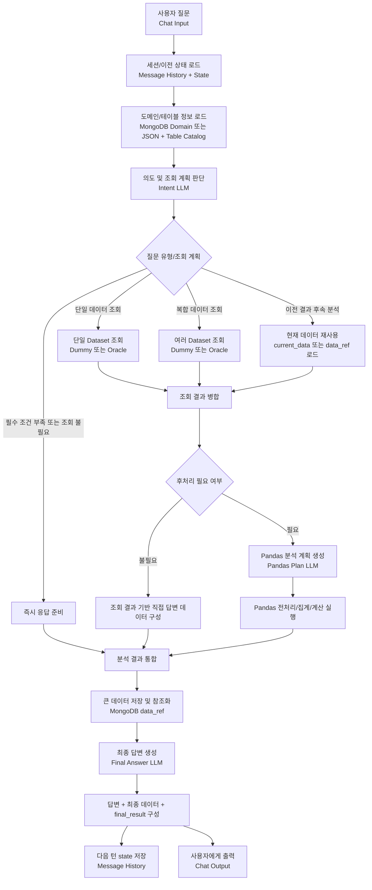

# Langflow v2 Requirements, Risks, and Workflow

이 문서는 현재 구현된 Langflow v2 제조 데이터 분석 flow를 기능 관점에서 요약한 문서이다.

목적은 다음 세 가지다.

1. 이 프로젝트가 다른 일반 챗봇/데이터 조회 flow와 어떤 차별점을 가지는지 정리한다.
2. 현재 구조에서 예상되는 risk와 대응 방안을 미리 정리한다.
3. normalize, parser 같은 부속 노드를 제외하고 기능 단위 workflow를 한눈에 볼 수 있게 한다.

## 1. 개발 요건과 주요 기능

### 1.1 Standalone Langflow Custom Component 구조

이 프로젝트의 Langflow v2 노드는 standalone 방식으로 구현한다.

즉, 각 custom component 파일은 Langflow에 직접 등록해도 동작해야 하며, 같은 폴더의 공통 모듈을 import하지 않는 것을 원칙으로 한다.

이 방식의 장점:

- Langflow 서버에 custom node를 올릴 때 Python path 문제를 줄일 수 있다.
- 노드 하나만 복사해도 동작 구조를 이해하기 쉽다.
- 운영 환경에서 repository 전체를 패키지처럼 배포하지 않아도 된다.

대신 각 파일 안에 작은 helper 함수가 반복될 수 있다. 이 중복은 Langflow standalone 환경을 위한 의도적인 선택이다.

### 1.2 기능 단위로 보이는 분기형 Flow

처음 구현은 직선형 flow에 가까웠지만, v2에서는 Langflow canvas에서 의도 분기가 보이도록 구성한다.

핵심 분기:

| 분기 | 의미 |
| --- | --- |
| `finish` | 데이터 조회 없이 바로 답변하거나 필수 조건 부족을 안내 |
| `single_retrieval` | 하나의 dataset만 조회 |
| `multi_retrieval` | 여러 dataset을 조회해서 병합 또는 계산 |
| `followup_transform` | 이전 결과를 기준으로 후속 분석 |
| `direct_response` | 조회 결과를 바로 답변에 사용 |
| `post_analysis` | pandas 전처리/집계/계산 후 답변 |

이 구조는 단순히 내부 코드에서 if문으로 처리하는 것보다, Langflow 화면에서 어떤 경로로 실행됐는지 확인하기 쉽다.

### 1.3 Intent LLM에서 조회 계획까지 판단

첫 번째 LLM 호출은 단순 의도 분류만 하지 않는다.

다음 정보를 함께 판단한다.

- 신규 조회인지, 이전 결과에 대한 후속 분석인지
- 필요한 dataset이 무엇인지
- 필터 조건이 무엇인지
- pandas 전처리가 필요한지
- metric 계산에 필요한 추가 dataset이 있는지

예를 들어 사용자가 "어제 WB공정 생산달성률을 mode별로 알려줘"라고 물으면, LLM이 `production`만 찾더라도 domain metric의 `required_datasets`를 참고해 `production + wip` 같은 복합 조회로 확장되어야 한다.

### 1.4 Domain과 Table 정보를 코드 밖에서 관리

도메인 지식과 테이블 카탈로그는 코드 안에 고정하지 않는다.

지원 방식:

- MongoDB에 저장된 domain item document 로딩
- Langflow 입력창에 직접 넣는 JSON domain fallback
- Table catalog JSON 입력
- 등록 웹에서 자연어를 LLM으로 변환해 MongoDB에 저장

이 구조를 쓰면 새로운 metric, 공정 alias, dataset 설명이 생겨도 custom component 코드를 매번 수정하지 않아도 된다.

### 1.5 LLM 호출부와 Prompt/후처리 분리

LLM 관련 처리는 한 노드에 몰아넣지 않는다.

기본 패턴:

```text
Prompt Builder
-> LLM Caller
-> Parser / Normalizer
-> Router or Executor
```

이렇게 나누는 이유:

- prompt에 들어간 정보가 잘못됐는지 확인하기 쉽다.
- LLM 응답 JSON이 깨졌는지 확인하기 쉽다.
- LLM 결과를 실제 flow route로 바꾸는 부분을 별도로 검증할 수 있다.
- 추후 LLM provider를 바꿔도 LLM Caller 중심으로 수정하면 된다.

현재 v2 기준 LLM 호출 지점은 세 곳이다.

| 위치 | 역할 |
| --- | --- |
| Intent LLM | 사용자 의도, dataset, filter, pandas 필요 여부 판단 |
| Pandas Plan LLM | 조회된 데이터와 domain 정보를 보고 전처리/집계 계획 생성 |
| Final Answer LLM | 최종 데이터와 분석 결과를 보고 자연어 답변 생성 |

### 1.6 Dummy/Oracle/MongoDB 조회 구조 분리

데이터 조회는 source별로 갈아끼울 수 있게 구성한다.

현재 기준:

- Dummy Data Retriever: Langflow 연결과 분기 테스트용
- Oracle Data Retriever: 실제 Oracle DB 조회용
- MongoDB Data Loader: 저장된 큰 데이터 재조회용
- Current Data Retriever: 후속 질문에서 이전 결과 재사용

각 retriever는 source가 달라도 비슷한 output schema를 반환해야 한다.

```json
{
  "success": true,
  "dataset_key": "production",
  "data": [],
  "summary": "total rows 12",
  "errors": []
}
```

### 1.7 큰 데이터는 Reference로 관리

조회 결과 전체를 매번 LLM prompt나 memory에 넣지 않는다.

권장 흐름:

```text
원본 row 또는 큰 중간 결과
-> MongoDB 저장
-> flow에는 data_ref, row_count, columns, preview, summary만 전달
-> 실제 계산이 필요할 때 data_ref로 다시 로드
```

이 방식은 token 비용과 latency를 줄이고, 후속 질문에서 이전 데이터를 안정적으로 재사용하기 위한 핵심 구조다.

### 1.8 최종 답변과 최종 데이터 동시 제공

최종 출력은 답변 문장만 반환하지 않는다.

사용자가 신뢰할 수 있도록 다음을 함께 제공한다.

- LLM이 작성한 자연어 답변
- 답변을 만들 때 실제로 사용한 최종 가공 데이터
- 다음 턴에서 쓸 state
- API/저장용 final result payload

따라서 "데이터를 보고 답변했다"는 구조가 flow output에서도 확인 가능하다.

### 1.9 Langflow Native Memory 기반 Multi-turn

후속 질문을 위해 Langflow Message History를 short-term memory처럼 사용한다.

다음 값을 유지해야 한다.

| 값 | 목적 |
| --- | --- |
| `chat_history` | 이전 질문/답변 흐름 |
| `context` | 최근 의도, filter, dataset 판단 |
| `current_data` | 후속 분석에 사용할 현재 결과 또는 data reference |

이 값이 유지되어야 "이때 가장 생산량이 많았던 mode 알려줘" 같은 질문이 신규 조회가 아니라 현재 결과 분석으로 이어진다.

## 2. Risk 및 대응 방안

### 2.1 LLM이 의도나 Dataset을 잘못 분류할 Risk

예상 문제:

- 후속 질문을 신규 조회로 판단한다.
- metric 계산에 필요한 dataset을 일부만 선택한다.
- filter 조건을 누락하거나 잘못 해석한다.
- pandas가 필요한 질문인데 direct response로 보낸다.

대응 방안:

- Intent prompt에 route 기준과 예시를 명확히 넣는다.
- domain metric의 `required_datasets`를 normalizer에서 강제 반영한다.
- table catalog에 dataset 용도, keyword, 날짜 기준, 대표 group by를 명확히 넣는다.
- 회귀 질문 세트를 유지한다.
- LLM 결과를 그대로 쓰지 않고 schema 정규화와 route 검증을 거친다.

### 2.2 잘못된 최종 답변 Risk

예상 문제:

- LLM이 최종 데이터와 다른 내용을 말한다.
- 단위, 합계, 최대/최소 값이 틀린다.
- 데이터가 비어 있는데 분석 결과가 있는 것처럼 답한다.

대응 방안:

- 계산은 LLM이 아니라 pandas executor에서 수행한다.
- Final Answer LLM에는 최종 가공 데이터와 요약값을 함께 제공한다.
- Final Answer Builder가 답변과 최종 데이터를 함께 출력한다.
- 데이터가 없거나 errors가 있으면 답변에 그 상태를 명확히 반영한다.
- 숫자 결과는 가능하면 analysis_result의 계산값을 우선 사용하고 LLM은 문장화만 담당하게 한다.

### 2.3 Token, Latency, Cost Risk

예상 문제:

- 조회 row 전체가 prompt에 들어가 token이 커진다.
- 후속 질문마다 이전 데이터가 반복 주입된다.
- domain/table 정보가 커지면서 prompt가 느려진다.

대응 방안:

- 큰 데이터는 MongoDB에 저장하고 `data_ref`만 flow에 유지한다.
- LLM에는 preview, row_count, columns, summary 중심으로 전달한다.
- domain item은 active 상태만 읽고, prompt에 필요한 범위로 압축한다.
- table catalog도 dataset 선택에 필요한 설명 중심으로 유지한다.
- preview row limit, fetch limit, answer row limit을 설정한다.

### 2.4 Multi-turn Memory 연결 실패 Risk

예상 문제:

- Playground에서 이전 state를 읽지 못한다.
- session id가 달라져 후속 질문이 이어지지 않는다.
- `current_data`가 사라져 follow-up 분석이 불가능하다.

대응 방안:

- Langflow Message History retrieve/store 연결을 필수 연결로 문서화한다.
- State Memory Message에 marker를 넣어 일반 대화 메시지와 구분한다.
- 다음 턴에 필요한 최소 state만 저장한다.
- `current_data` 원본이 클 경우 `data_ref`와 summary를 함께 저장한다.
- 디버깅 시 State Memory Extractor 출력의 `memory_loaded`, `memory_record_count`를 먼저 확인한다.

### 2.5 Domain Registry 관리 어려움 Risk

예상 문제:

- 같은 alias가 여러 item에 중복 저장된다.
- metric formula가 dataset schema와 맞지 않는다.
- 오래된 domain item이 계속 prompt에 들어간다.

대응 방안:

- `gbn + key` 기준으로 item을 관리한다.
- alias, dataset keyword 중복 검사를 둔다.
- `status=active` item만 main flow에서 사용한다.
- 검토가 필요한 item은 `review_required` 상태로 저장한다.
- 등록 웹에서 항목별 조회/삭제/검토 기능을 제공한다.

### 2.6 DB 조회 안정성 Risk

예상 문제:

- Oracle 연결 정보 입력 형식이 깨진다.
- TNS/DSN 문자열 줄바꿈 때문에 JSON 파싱이 실패한다.
- 잘못된 dataset key로 의도하지 않은 query가 실행된다.
- 조회량이 너무 많아 응답이 느려진다.

대응 방안:

- DB config 입력에서 따옴표 1개/3개 문자열을 모두 정리해 받는다.
- dataset key와 query template은 table catalog 기반 whitelist로 관리한다.
- 날짜, 공정, mode 같은 filter는 정규화 후 query에 반영한다.
- fetch limit과 row count summary를 둔다.
- 연결 실패와 query 실패를 `errors` payload로 명확히 반환한다.

### 2.7 Pandas 실행 Risk

예상 문제:

- LLM이 생성한 pandas code가 실패한다.
- 예상과 다른 컬럼명을 사용한다.
- 위험한 Python 코드가 실행될 수 있다.

대응 방안:

- Pandas plan normalizer에서 허용 schema를 검증한다.
- executor에서 사용 가능한 namespace를 제한한다.
- 원본 rows와 columns를 기준으로 존재하지 않는 컬럼을 사전 검증한다.
- 실패 시 fallback summary 또는 오류 메시지를 반환한다.
- 운영 환경에서는 timeout, row limit, 허용 함수 whitelist를 강화한다.

### 2.8 노드 수 증가로 인한 관리 Risk

예상 문제:

- 노드가 많아져 연결 순서가 헷갈린다.
- 같은 LLM Caller를 여러 번 쓰면서 어떤 caller인지 혼동한다.
- 수정 위치를 찾기 어렵다.

대응 방안:

- 파일명 번호를 실제 연결 순서와 맞춘다.
- README의 Exact Connection Map을 유지한다.
- `detail_desc/`에 노드별 설명을 둔다.
- LLM Caller는 canvas에서 `(Intent)`, `(Pandas)`, `(Answer)`처럼 instance 이름을 구분한다.
- 노드 status에 핵심 실행 결과를 남긴다.

### 2.9 Encoding 및 한글 출력 Risk

예상 문제:

- Windows/PowerShell/DB/웹 출력 과정에서 한글이 깨진다.
- Langflow component 출력이 mojibake 형태로 보인다.

대응 방안:

- 문서와 JSON 예시는 UTF-8 기준으로 저장한다.
- Python 문자열 처리에서 불필요한 encode/decode 변환을 피한다.
- DB client와 웹 출력의 charset 설정을 확인한다.
- 깨진 문자열을 후처리로 보정하기보다, 입력/저장/출력 경로의 encoding을 먼저 점검한다.

## 3. 시스템 구상도

아래 workflow는 기능 단위 흐름만 나타낸다. Parser, normalizer, adapter 같은 부속 노드는 생략했다.



### 3.1 기능 단위 Workflow 설명

| 단계 | 기능 | 핵심 결과 |
| --- | --- | --- |
| 사용자 질문 입력 | 사용자가 자연어로 질문한다. | `user_question` |
| 세션/이전 상태 로드 | 이전 대화, context, current data를 읽는다. | `state` |
| 도메인/테이블 정보 로드 | metric, alias, dataset 설명을 불러온다. | `domain_payload`, `table_catalog_payload` |
| 의도 및 조회 계획 판단 | 후속 분석/신규 조회/필터/dataset/pandas 필요 여부를 판단한다. | `intent_plan` |
| 분기 처리 | finish, follow-up, single, multi로 나눈다. | selected route |
| 데이터 조회 또는 재사용 | 필요한 데이터를 가져오거나 이전 데이터를 재사용한다. | `source_results` |
| 후처리 판단 | direct response인지 pandas 분석인지 나눈다. | postprocess route |
| pandas 분석 | 집계, 계산, 정렬, 필터링을 수행한다. | `final_data` |
| 큰 데이터 참조화 | 큰 row list를 MongoDB에 저장하고 reference만 유지한다. | `data_ref`, preview |
| 최종 답변 생성 | 최종 데이터를 기반으로 자연어 답변을 만든다. | `response` |
| 최종 출력 | 답변과 최종 데이터를 함께 보여준다. | `answer_message`, `final_result` |
| 다음 state 저장 | 후속 질문을 위해 state를 저장한다. | `next_state` |

### 3.2 대표 실행 시나리오

#### 단일 데이터 조회

```text
"오늘 DA공정 생산량 알려줘"
-> retrieval
-> single_retrieval
-> production 조회
-> direct_response 또는 post_analysis
-> 답변 + 최종 데이터 출력
```

#### 복합 데이터 조회

```text
"어제 WB공정 생산달성률을 mode별로 알려줘"
-> retrieval
-> metric required_datasets 확인
-> production + wip 조회
-> post_analysis
-> 생산달성률 계산
-> 답변 + mode별 최종 데이터 출력
```

#### 후속 분석

```text
"이때 가장 생산량이 많았던 mode를 알려줘"
-> followup_transform
-> current_data 또는 data_ref 로드
-> post_analysis
-> mode별 최대 생산량 계산
-> 답변 + 최종 데이터 출력
```

## 4. 운영 시 우선 확인할 체크리스트

- Message History retrieve/store가 연결되어 있는가
- `State Memory Extractor.memory_loaded`가 true로 나오는가
- domain item 중 필요한 metric이 `status=active`인가
- metric의 `required_datasets`가 정확한가
- table catalog에 dataset keyword와 date filter 기준이 들어 있는가
- Intent LLM 결과가 route와 retrieval jobs를 올바르게 반환하는가
- multi dataset 질문이 `multi_retrieval`로 가는가
- follow-up 질문이 `followup_transform`으로 가는가
- pandas 결과의 최종 데이터가 답변과 함께 출력되는가
- 큰 데이터가 prompt/memory에 그대로 들어가지 않고 `data_ref`로 줄어드는가
