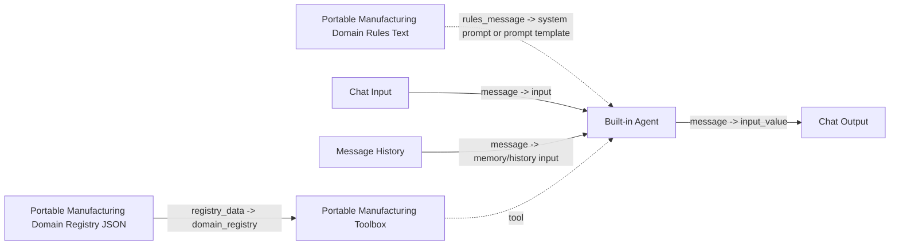
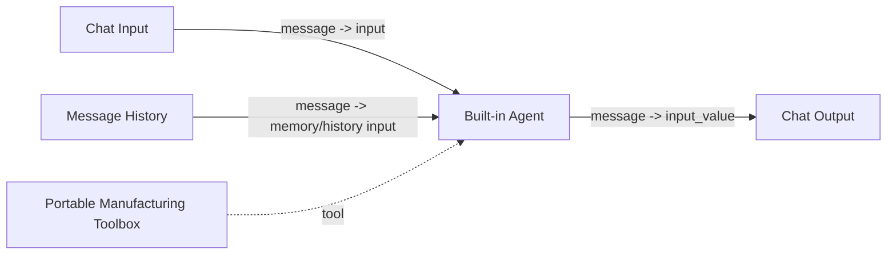

# Agent / Tool Calling 방식

## 2026-04 업데이트: 권장 구성

도메인 규칙을 텍스트로 LLM/Agent 쪽에 전달하고, 추가 도메인 등록 내용은 JSON으로 toolbox에 주입하려면 아래 구성을 권장합니다.

포트 연결:

1. `Portable Manufacturing Domain Rules Text.rules_message` -> Agent의 system prompt 입력 또는 Prompt Template/LLM Model의 system message 입력
2. `Portable Manufacturing Domain Registry JSON.registry_data` -> `Portable Manufacturing Toolbox.domain_registry`
3. `Chat Input.message` -> `Agent.input`
4. `Message History.message` -> `Agent`의 memory/history 입력
5. `Portable Manufacturing Toolbox` -> `Agent`의 tool 입력 슬롯
6. `Agent.message` -> `Chat Output.input_value`

중요한 점:

- `Portable Manufacturing Toolbox`는 `domain_registry`가 연결되면 기본 내장 규칙보다 그 JSON 스냅샷을 우선해서 dataset 키워드, value group, analysis rule, join rule, tool name을 해석합니다.
- 그래서 Add Custom Node 환경에서도 `후공정A`, `생산 목표 차이율`, `HOLD 이상여부`, `양품률` 같은 추가 등록 규칙을 실제 tool selection과 결과 계산에 반영할 수 있습니다.

이 방식은 Agent가 `Portable Manufacturing Toolbox`를 하나의 tool처럼 호출하는 구조입니다.

## Mermaid

## 실제 배선 순서

1. `Chat Input`
2. `Message History`
3. built-in `Agent`
4. `Portable Manufacturing Toolbox`
5. `Chat Output`

포트 연결은 아래처럼 합니다.

1. `Chat Input.message` -> `Agent.input`
2. `Message History.message` -> `Agent`의 memory/history 입력 포트
3. `Portable Manufacturing Toolbox`는 Agent의 tool 입력에 연결
4. `Agent.message` -> `Chat Output.input_value`

주의할 점:

- Agent 노드의 정확한 포트 이름은 배포된 Langflow 패치 버전에 따라 `input`, `message`, `tools`, `memory`처럼 조금 달라질 수 있습니다.
- 이 경우에도 핵심 연결 의미는 같습니다.
  - user message -> agent input
  - message history -> agent memory
  - toolbox -> agent tool slot
  - agent response -> chat output

## 특징

- 커스텀 노드 수가 가장 적습니다.
- Agent가 tool selection을 담당합니다.
- 동일한 synthetic 제조 조회 / follow-up 로직을 하나의 노드 안에서 수행합니다.
- `Portable Manufacturing Toolbox` 내부에서 세션 저장도 할 수 있습니다.

## 권장 상황

- 이미 Agent 중심의 Langflow 구성이 있는 경우
- Prompt / Tool / Memory를 Agent 패턴으로 통일하고 싶은 경우
- 분기형 캔버스보다 단순한 배치를 원하는 경우

## 주의

- Agent의 tool 인식 방식은 배포 환경 설정에 영향을 받을 수 있습니다.
- 가장 안정적인 방식은 [FLOW_STANDALONE.md](C:/Users/qkekt/Desktop/langflow_local_manufacturing_project/portable_langflow_1_8_bundle/FLOW_STANDALONE.md)에 정리된 branch-visible 플로우입니다.
LLM 기반 파라미터 추출, sufficiency review, retry re-plan, pandas 분석까지 포함한 흐름은 [FLOW_LLM_HIGH_FIDELITY.md](C:/Users/qkekt/Desktop/langflow_local_manufacturing_project/portable_langflow_1_8_bundle/FLOW_LLM_HIGH_FIDELITY.md)를 참고하세요.
