# LLM High-Fidelity Portable Flow

이 문서는 `Add Custom Node`만 가능한 Langflow 1.8.0 환경에서, 기존 제조 LangGraph 코어의 핵심 구조를 최대한 닮게 가져가는 portable 플로우를 설명합니다.

반영 대상:
- LLM 기반 파라미터 추출
- LLM 기반 retrieval planning
- tool call 기반 데이터 조회
- sufficiency review
- retry re-plan
- pandas 코드 생성 분석

## 권장 구조

```mermaid
flowchart LR
  CI["Chat Input"]
  MH["Message History"]
  DR["Portable Manufacturing Domain Rules Text"]
  DJ["Portable Manufacturing Domain Registry JSON"]
  SS["Portable Manufacturing Session State"]

  PP["Portable Manufacturing LLM Param Prompt"]
  LM1["LLM Model (params)"]
  PR["Portable Manufacturing LLM Param Parser"]

  AP1["Portable Manufacturing Pandas Analysis Prompt (followup)"]
  LM2["LLM Model (followup analysis)"]
  AX1["Portable Manufacturing Pandas Analysis Executor (followup)"]

  RP1["Portable Manufacturing LLM Retrieval Plan Prompt"]
  LM3["LLM Model (retrieval plan)"]
  RP2["Portable Manufacturing LLM Retrieval Plan Parser"]

  TE1["Portable Manufacturing Tool Executor"]
  SP["Portable Manufacturing Sufficiency Prompt"]
  LM4["LLM Model (sufficiency review)"]
  SR["Portable Manufacturing Sufficiency Parser"]

  RR["Portable Manufacturing Retry Replan"]
  TE2["Portable Manufacturing Tool Executor (retry)"]

  AP2["Portable Manufacturing Pandas Analysis Prompt (retrieval)"]
  LM5["LLM Model (retrieval analysis)"]
  AX2["Portable Manufacturing Pandas Analysis Executor (retrieval)"]

  AP3["Portable Manufacturing Pandas Analysis Prompt (retry)"]
  LM6["LLM Model (retry analysis)"]
  AX3["Portable Manufacturing Pandas Analysis Executor (retry)"]

  MG["Portable Manufacturing Merge Result"]
  SV["Portable Manufacturing Session Save"]
  CO["Chat Output"]

  CI -->|"message -> message"| SS
  MH -->|"message -> message_history"| SS

  SS -->|"session_state -> state"| PP
  DR -->|"rules_message -> domain_rules"| PP
  DJ -->|"registry_data -> domain_registry"| PP
  PP -->|"prompt_message -> input"| LM1
  DR -. "rules_message -> system_message (optional)" .-> LM1
  LM1 -->|"message -> llm_message"| PR
  SS -->|"session_state -> state"| PR
  DJ -->|"registry_data -> domain_registry"| PR

  PR -->|"followup_state -> state"| AP1
  DR -->|"rules_message -> domain_rules"| AP1
  DJ -->|"registry_data -> domain_registry"| AP1
  AP1 -->|"prompt_message -> input"| LM2
  DR -. "rules_message -> system_message (optional)" .-> LM2
  LM2 -->|"message -> llm_message"| AX1
  PR -->|"followup_state -> state"| AX1
  DJ -->|"registry_data -> domain_registry"| AX1

  PR -->|"retrieval_state -> state"| RP1
  DR -->|"rules_message -> domain_rules"| RP1
  DJ -->|"registry_data -> domain_registry"| RP1
  RP1 -->|"prompt_message -> input"| LM3
  DR -. "rules_message -> system_message (optional)" .-> LM3
  LM3 -->|"message -> llm_message"| RP2
  PR -->|"retrieval_state -> state"| RP2
  DJ -->|"registry_data -> domain_registry"| RP2

  RP2 -->|"jobs_state -> state"| TE1
  DJ -->|"registry_data -> domain_registry"| TE1
  RP2 -->|"finish_result -> finish_result"| MG

  TE1 -->|"state_with_source_results -> state"| SP
  DR -->|"rules_message -> domain_rules"| SP
  DJ -->|"registry_data -> domain_registry"| SP
  SP -->|"prompt_message -> input"| LM4
  DR -. "rules_message -> system_message (optional)" .-> LM4
  LM4 -->|"message -> llm_message"| SR
  TE1 -->|"state_with_source_results -> state"| SR
  DJ -->|"registry_data -> domain_registry"| SR

  SR -->|"sufficient_state -> state"| AP2
  DR -->|"rules_message -> domain_rules"| AP2
  DJ -->|"registry_data -> domain_registry"| AP2
  AP2 -->|"prompt_message -> input"| LM5
  DR -. "rules_message -> system_message (optional)" .-> LM5
  LM5 -->|"message -> llm_message"| AX2
  SR -->|"sufficient_state -> state"| AX2
  DJ -->|"registry_data -> domain_registry"| AX2

  SR -->|"retry_state -> state"| RR
  RR -->|"replanned_state -> state"| TE2
  DJ -->|"registry_data -> domain_registry"| TE2
  TE2 -->|"state_with_source_results -> state"| AP3
  DR -->|"rules_message -> domain_rules"| AP3
  DJ -->|"registry_data -> domain_registry"| AP3
  AP3 -->|"prompt_message -> input"| LM6
  DR -. "rules_message -> system_message (optional)" .-> LM6
  LM6 -->|"message -> llm_message"| AX3
  TE2 -->|"state_with_source_results -> state"| AX3
  DJ -->|"registry_data -> domain_registry"| AX3

  AX1 -->|"result_data -> followup_result"| MG
  AX2 -->|"result_data -> retrieval_result"| MG
  AX3 -->|"result_data -> retry_result"| MG

  MG -->|"merged_result -> result"| SV
  CI -->|"message -> message"| SV
  SV -->|"response_message -> input_value"| CO
```

## 배선 순서

### 1. 공통 입력

1. `Chat Input`
2. `Message History`
3. `Portable Manufacturing Domain Rules Text`
4. `Portable Manufacturing Domain Registry JSON`
5. `Portable Manufacturing Session State`

### 2. 파라미터 추출

1. `Portable Manufacturing LLM Param Prompt`
2. `LLM Model (params)`
3. `Portable Manufacturing LLM Param Parser`

### 3. follow-up 분석 경로

1. `Portable Manufacturing Pandas Analysis Prompt (followup)`
2. `LLM Model (followup analysis)`
3. `Portable Manufacturing Pandas Analysis Executor (followup)`

### 4. retrieval 계획 및 sufficiency 경로

1. `Portable Manufacturing LLM Retrieval Plan Prompt`
2. `LLM Model (retrieval plan)`
3. `Portable Manufacturing LLM Retrieval Plan Parser`
4. `Portable Manufacturing Tool Executor`
5. `Portable Manufacturing Sufficiency Prompt`
6. `LLM Model (sufficiency review)`
7. `Portable Manufacturing Sufficiency Parser`

### 5. sufficient analysis 경로

1. `Portable Manufacturing Pandas Analysis Prompt (retrieval)`
2. `LLM Model (retrieval analysis)`
3. `Portable Manufacturing Pandas Analysis Executor (retrieval)`

### 6. retry 경로

1. `Portable Manufacturing Retry Replan`
2. `Portable Manufacturing Tool Executor (retry)`
3. `Portable Manufacturing Pandas Analysis Prompt (retry)`
4. `LLM Model (retry analysis)`
5. `Portable Manufacturing Pandas Analysis Executor (retry)`

### 7. 결과 머지 및 저장

1. `Portable Manufacturing Merge Result`
2. `Portable Manufacturing Session Save`
3. `Chat Output`

## 주의

- `Portable Manufacturing Merge Result`는 이제 `retry_result` 입력도 받습니다.
- 각 `LLM Model`은 같은 모델로 복제해서 써도 됩니다.
- `Domain Rules Text`는 custom prompt 노드에 넣는 것만으로도 충분하지만, 가능하면 각 `LLM Model.system_message`에도 같이 연결하는 편이 더 안정적입니다.
- `Portable Manufacturing Tool Executor`는 기존 lightweight 버전보다 richer schema와 tool name을 사용합니다.
- `Portable Manufacturing Pandas Analysis Executor`는 생성 코드가 unsafe하거나 잘못되면 domain-rule fallback 또는 minimal fallback을 사용합니다.

## Add Custom Node 추가 순서

아래 순서대로 추가하면 오류를 분리해서 보기 쉽습니다.

1. `Portable Manufacturing Domain Rules Text`
2. `Portable Manufacturing Domain Registry JSON`
3. `Portable Manufacturing Session State`
4. `Portable Manufacturing LLM Param Prompt`
5. `Portable Manufacturing LLM Param Parser`
6. `Portable Manufacturing LLM Retrieval Plan Prompt`
7. `Portable Manufacturing LLM Retrieval Plan Parser`
8. `Portable Manufacturing Tool Executor`
9. `Portable Manufacturing Sufficiency Prompt`
10. `Portable Manufacturing Sufficiency Parser`
11. `Portable Manufacturing Retry Replan`
12. `Portable Manufacturing Pandas Analysis Prompt`
13. `Portable Manufacturing Pandas Analysis Executor`
14. `Portable Manufacturing Merge Result`
15. `Portable Manufacturing Session Save`

필요 시:

16. `Portable Dependency Bootstrap`

## 정확한 포트 연결 순서

### A. 입력과 세션 상태

1. `Chat Input.message` -> `Portable Manufacturing Session State.message`

### B. 파라미터 추출

2. `Portable Manufacturing Session State.session_state` -> `Portable Manufacturing LLM Param Prompt.state`
3. `Portable Manufacturing Domain Rules Text.rules_message` -> `Portable Manufacturing LLM Param Prompt.domain_rules`
4. `Portable Manufacturing Domain Registry JSON.registry_data` -> `Portable Manufacturing LLM Param Prompt.domain_registry`
5. `Portable Manufacturing LLM Param Prompt.prompt_message` -> `LLM Model (params).input`
6. `LLM Model (params).message` -> `Portable Manufacturing LLM Param Parser.llm_message`
7. `Portable Manufacturing Session State.session_state` -> `Portable Manufacturing LLM Param Parser.state`
8. `Portable Manufacturing Domain Registry JSON.registry_data` -> `Portable Manufacturing LLM Param Parser.domain_registry`

### C. follow-up branch

9. `Portable Manufacturing LLM Param Parser.followup_state` -> `Portable Manufacturing Pandas Analysis Prompt (followup).state`
10. `Portable Manufacturing Domain Rules Text.rules_message` -> `Portable Manufacturing Pandas Analysis Prompt (followup).domain_rules`
11. `Portable Manufacturing Domain Registry JSON.registry_data` -> `Portable Manufacturing Pandas Analysis Prompt (followup).domain_registry`
12. `Portable Manufacturing Pandas Analysis Prompt (followup).prompt_message` -> `LLM Model (followup analysis).input`
13. `LLM Model (followup analysis).message` -> `Portable Manufacturing Pandas Analysis Executor (followup).llm_message`
14. `Portable Manufacturing LLM Param Parser.followup_state` -> `Portable Manufacturing Pandas Analysis Executor (followup).state`
15. `Portable Manufacturing Domain Registry JSON.registry_data` -> `Portable Manufacturing Pandas Analysis Executor (followup).domain_registry`

### D. retrieval planning

16. `Portable Manufacturing LLM Param Parser.retrieval_state` -> `Portable Manufacturing LLM Retrieval Plan Prompt.state`
17. `Portable Manufacturing Domain Rules Text.rules_message` -> `Portable Manufacturing LLM Retrieval Plan Prompt.domain_rules`
18. `Portable Manufacturing Domain Registry JSON.registry_data` -> `Portable Manufacturing LLM Retrieval Plan Prompt.domain_registry`
19. `Portable Manufacturing LLM Retrieval Plan Prompt.prompt_message` -> `LLM Model (retrieval plan).input`
20. `LLM Model (retrieval plan).message` -> `Portable Manufacturing LLM Retrieval Plan Parser.llm_message`
21. `Portable Manufacturing LLM Param Parser.retrieval_state` -> `Portable Manufacturing LLM Retrieval Plan Parser.state`
22. `Portable Manufacturing Domain Registry JSON.registry_data` -> `Portable Manufacturing LLM Retrieval Plan Parser.domain_registry`

### E. tool 실행

23. `Portable Manufacturing LLM Retrieval Plan Parser.jobs_state` -> `Portable Manufacturing Tool Executor.state`
24. `Portable Manufacturing Domain Registry JSON.registry_data` -> `Portable Manufacturing Tool Executor.domain_registry`

### F. sufficiency review

25. `Portable Manufacturing Tool Executor.state_with_source_results` -> `Portable Manufacturing Sufficiency Prompt.state`
26. `Portable Manufacturing Domain Rules Text.rules_message` -> `Portable Manufacturing Sufficiency Prompt.domain_rules`
27. `Portable Manufacturing Domain Registry JSON.registry_data` -> `Portable Manufacturing Sufficiency Prompt.domain_registry`
28. `Portable Manufacturing Sufficiency Prompt.prompt_message` -> `LLM Model (sufficiency review).input`
29. `LLM Model (sufficiency review).message` -> `Portable Manufacturing Sufficiency Parser.llm_message`
30. `Portable Manufacturing Tool Executor.state_with_source_results` -> `Portable Manufacturing Sufficiency Parser.state`
31. `Portable Manufacturing Domain Registry JSON.registry_data` -> `Portable Manufacturing Sufficiency Parser.domain_registry`

### G. sufficient retrieval analysis

32. `Portable Manufacturing Sufficiency Parser.sufficient_state` -> `Portable Manufacturing Pandas Analysis Prompt (retrieval).state`
33. `Portable Manufacturing Domain Rules Text.rules_message` -> `Portable Manufacturing Pandas Analysis Prompt (retrieval).domain_rules`
34. `Portable Manufacturing Domain Registry JSON.registry_data` -> `Portable Manufacturing Pandas Analysis Prompt (retrieval).domain_registry`
35. `Portable Manufacturing Pandas Analysis Prompt (retrieval).prompt_message` -> `LLM Model (retrieval analysis).input`
36. `LLM Model (retrieval analysis).message` -> `Portable Manufacturing Pandas Analysis Executor (retrieval).llm_message`
37. `Portable Manufacturing Sufficiency Parser.sufficient_state` -> `Portable Manufacturing Pandas Analysis Executor (retrieval).state`
38. `Portable Manufacturing Domain Registry JSON.registry_data` -> `Portable Manufacturing Pandas Analysis Executor (retrieval).domain_registry`

### H. retry branch

39. `Portable Manufacturing Sufficiency Parser.retry_state` -> `Portable Manufacturing Retry Replan.state`
40. `Portable Manufacturing Retry Replan.replanned_state` -> `Portable Manufacturing Tool Executor (retry).state`
41. `Portable Manufacturing Domain Registry JSON.registry_data` -> `Portable Manufacturing Tool Executor (retry).domain_registry`
42. `Portable Manufacturing Tool Executor (retry).state_with_source_results` -> `Portable Manufacturing Pandas Analysis Prompt (retry).state`
43. `Portable Manufacturing Domain Rules Text.rules_message` -> `Portable Manufacturing Pandas Analysis Prompt (retry).domain_rules`
44. `Portable Manufacturing Domain Registry JSON.registry_data` -> `Portable Manufacturing Pandas Analysis Prompt (retry).domain_registry`
45. `Portable Manufacturing Pandas Analysis Prompt (retry).prompt_message` -> `LLM Model (retry analysis).input`
46. `LLM Model (retry analysis).message` -> `Portable Manufacturing Pandas Analysis Executor (retry).llm_message`
47. `Portable Manufacturing Tool Executor (retry).state_with_source_results` -> `Portable Manufacturing Pandas Analysis Executor (retry).state`
48. `Portable Manufacturing Domain Registry JSON.registry_data` -> `Portable Manufacturing Pandas Analysis Executor (retry).domain_registry`

### I. 결과 머지

49. `Portable Manufacturing LLM Retrieval Plan Parser.finish_result` -> `Portable Manufacturing Merge Result.finish_result`
50. `Portable Manufacturing Pandas Analysis Executor (followup).result_data` -> `Portable Manufacturing Merge Result.followup_result`
51. `Portable Manufacturing Pandas Analysis Executor (retrieval).result_data` -> `Portable Manufacturing Merge Result.retrieval_result`
52. `Portable Manufacturing Pandas Analysis Executor (retry).result_data` -> `Portable Manufacturing Merge Result.retry_result`

### J. 세션 저장과 출력

53. `Portable Manufacturing Merge Result.merged_result` -> `Portable Manufacturing Session Save.result`
54. `Chat Input.message` -> `Portable Manufacturing Session Save.message`
55. `Portable Manufacturing Session Save.response_message` -> `Chat Output.input_value`
