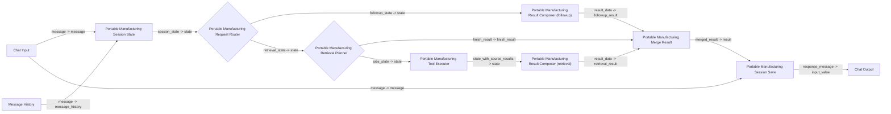

# 기본 권장 플로우

이 플로우는 Langflow의 기본 `Chat Input`, `Message History`, `Chat Output`를 쓰고, 필요한 부분만 custom node로 보강하는 방식입니다.

## 최종 Mermaid

## 실제 배선 순서

### 1. 기본 노드 배치

아래 순서대로 캔버스에 노드를 놓습니다.

1. `Chat Input`
2. `Message History`
3. `Portable Manufacturing Session State`
4. `Portable Manufacturing Request Router`
5. `Portable Manufacturing Retrieval Planner`
6. `Portable Manufacturing Tool Executor`
7. `Portable Manufacturing Result Composer`
8. `Portable Manufacturing Result Composer`
9. `Portable Manufacturing Merge Result`
10. `Portable Manufacturing Session Save`
11. `Chat Output`

`Portable Manufacturing Result Composer`는 2개가 필요합니다.

- 하나는 `followup` branch
- 하나는 `retrieval` branch

노드 이름을 아래처럼 바꿔두면 덜 헷갈립니다.

- `Portable Manufacturing Result Composer (followup)`
- `Portable Manufacturing Result Composer (retrieval)`

### 2. 포트 기준 연결 순서

아래 순서대로 선을 연결하면 됩니다.

1. `Chat Input.message` -> `Portable Manufacturing Session State.message`
2. `Message History.message` -> `Portable Manufacturing Session State.message_history`
3. `Portable Manufacturing Session State.session_state` -> `Portable Manufacturing Request Router.state`
4. `Portable Manufacturing Request Router.followup_state` -> `Portable Manufacturing Result Composer (followup).state`
5. `Portable Manufacturing Request Router.retrieval_state` -> `Portable Manufacturing Retrieval Planner.state`
6. `Portable Manufacturing Retrieval Planner.finish_result` -> `Portable Manufacturing Merge Result.finish_result`
7. `Portable Manufacturing Retrieval Planner.jobs_state` -> `Portable Manufacturing Tool Executor.state`
8. `Portable Manufacturing Tool Executor.state_with_source_results` -> `Portable Manufacturing Result Composer (retrieval).state`
9. `Portable Manufacturing Result Composer (followup).result_data` -> `Portable Manufacturing Merge Result.followup_result`
10. `Portable Manufacturing Result Composer (retrieval).result_data` -> `Portable Manufacturing Merge Result.retrieval_result`
11. `Portable Manufacturing Merge Result.merged_result` -> `Portable Manufacturing Session Save.result`
12. `Chat Input.message` -> `Portable Manufacturing Session Save.message`
13. `Portable Manufacturing Session Save.response_message` -> `Chat Output.input_value`

### 3. 첫 실행 권장 입력

- `Chat Input`: `어제 D/A3 생산 보여줘`
- `Portable Manufacturing Session State.reset_session`: 첫 테스트면 `True`
- `Chat Output`: 기본 템플릿 그대로 사용 가능

### 4. 멀티턴 테스트

첫 질문 이후 같은 세션에서 아래처럼 이어서 입력합니다.

- `그 결과를 공정별로 정리해줘`
- `상위 3개만 보여줘`
- `평균도 같이 알려줘`

### 5. branch 동작 확인 포인트

- follow-up 질문이면 `Portable Manufacturing Request Router.followup_state`만 활성화됩니다.
- 신규 조회면 `Portable Manufacturing Request Router.retrieval_state`가 활성화됩니다.
- 날짜가 없으면 `Portable Manufacturing Retrieval Planner.finish_result`로 조기 종료됩니다.
- 정상 조회면 `Portable Manufacturing Tool Executor`를 거쳐 `Portable Manufacturing Result Composer (retrieval)`로 이어집니다.

## 노드별 역할

- `Portable Manufacturing Session State`
  - 세션 파일을 읽어서 `chat_history`, `context`, `current_data`를 state로 복원합니다.
- `Portable Manufacturing Request Router`
  - 질문에서 날짜/공정/의도 등을 추출하고 follow-up / retrieval을 나눕니다.
- `Portable Manufacturing Retrieval Planner`
  - 어떤 dataset이 필요한지 결정하고, 바로 종료할지 조회를 실행할지 판단합니다.
- `Portable Manufacturing Tool Executor`
  - synthetic 제조 데이터 조회를 수행합니다.
- `Portable Manufacturing Result Composer`
  - follow-up 변환 또는 retrieval 결과를 최종 응답 payload로 만듭니다.
- `Portable Manufacturing Merge Result`
  - branch 결과 중 실제 결과 하나를 선택합니다.
- `Portable Manufacturing Session Save`
  - 이번 턴의 결과를 세션 파일에 저장하고 Chat Output용 `Message`를 만듭니다.

## 선택 옵션

### Message History 연결

- 이미 `Session Save`가 파일 기반으로 상태를 저장하므로 필수는 아닙니다.
- 다만 Playground의 최근 대화 문맥도 같이 보이고 싶다면 `Message History`를 연결합니다.

### LLM MODEL 연결

기본 구현은 규칙 기반 응답 생성입니다. 더 자연스러운 답변이 필요하면 `Portable Manufacturing Result Composer` 대신 아래 패턴을 추가로 쓸 수 있습니다.

- `Portable Manufacturing Result Composer.result_data`
- 커스텀 텍스트 포맷 노드 또는 기본 변환 노드
- `Prompt Template`
- `LLM MODEL`
- `Portable Manufacturing Session Save`

## 빠른 테스트 질문

- `어제 D/A3 생산 보여줘`
- `그 결과를 공정별로 정리해줘`
- `어제 불량률 보여줘`
- `오늘 목표 대비 달성률 알려줘`
최신 LLM 기반 고충실도 배선은 [FLOW_LLM_HIGH_FIDELITY.md](C:/Users/qkekt/Desktop/langflow_local_manufacturing_project/portable_langflow_1_8_bundle/FLOW_LLM_HIGH_FIDELITY.md)를 참고하세요.
