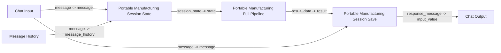

# 도메인 강화형 Portable Flow

이 문서는 `portable_langflow_1_8_bundle` 안의 간편형 노드 대신, **도메인 규칙 / registry / 분석 rule을 더 강하게 반영한 full-fidelity 노드**를 사용하는 흐름을 설명합니다.

## 언제 이 흐름을 쓰는가

- 기존 LangGraph 코어와 더 가까운 질문 해석을 원할 때
- `후공정A`, `양품률`, `홀드 부하지수`, `생산 목표 차이율`, `HOLD 이상여부` 같은 등록 규칙을 portable에서도 반영하고 싶을 때
- branch-visible 구조보다 규칙 반영 우선순위가 더 중요할 때

## 포함된 강화 요소

- `PROCESS_GROUPS`
  - `D/A`, `W/B`, `FCB`, `P/C`, `SAT`, `PL` 등 공정 그룹
- `MODE_GROUPS`
  - `DDR4`, `DDR5`, `LPDDR5`
- `DEN_GROUPS`
  - `256G`, `512G`, `1T`
- `TECH_GROUPS`
  - `LC`, `FO`, `FC`
- `PKG_TYPE1_GROUPS`
  - `FCBGA`, `LFBGA`
- `PKG_TYPE2_GROUPS`
  - `ODP`, `16DP`, `SDP`
- registry 기반 custom value group
  - `후공정A -> D/A1, D/A2`
- registry 기반 analysis rules
  - `HOLD 이상여부`
  - `생산 목표 차이율`
  - `홀드 부하지수`
  - `양품률 -> yield dataset 매핑`
- 기본 analysis rules
  - `achievement_rate`
  - `yield_rate`
  - `production_saturation_rate`

## 같이 쓰면 좋은 보조 노드

- `Portable Manufacturing Domain Rules Text`
  - built-in LLM Model 또는 Prompt Template의 system message 입력으로 연결
- `Portable Manufacturing Domain Registry JSON`
  - Agent/toolbox 쪽 `domain_registry` 입력으로 연결
  - 현재 추가 등록된 value group, analysis rule, join rule을 JSON 형태로 눈에 보이게 전달할 수 있음

## 권장 플로우

## 실제 배선 순서

1. `Chat Input`
2. `Message History`
3. `Portable Manufacturing Session State`
4. `Portable Manufacturing Full Pipeline`
5. `Portable Manufacturing Session Save`
6. `Chat Output`

포트 연결:

1. `Chat Input.message` -> `Portable Manufacturing Session State.message`
2. `Message History.message` -> `Portable Manufacturing Session State.message_history`
3. `Portable Manufacturing Session State.session_state` -> `Portable Manufacturing Full Pipeline.state`
4. `Portable Manufacturing Full Pipeline.result_data` -> `Portable Manufacturing Session Save.result`
5. `Chat Input.message` -> `Portable Manufacturing Session Save.message`
6. `Portable Manufacturing Session Save.response_message` -> `Chat Output.input_value`

## 테스트 질문

- `어제 후공정A 생산 보여줘`
- `어제 양품률 보여줘`
- `어제 생산 목표 차이율 보여줘`
- `어제 홀드 부하지수 보여줘`
- `어제 WIP HOLD 이상여부 보여줘`

## 주의

이 노드는 기존 portable 간편형보다 훨씬 풍부한 도메인 규칙을 내장했지만, 그래도 **기존 LangGraph 코어와 바이트 단위로 동일한 구현은 아닙니다.**

특히 아래는 차이가 남을 수 있습니다.

- LLM 기반 파라미터 추출 정교도
- 코어의 sufficiency review / retry re-plan
- pandas code generation 기반 자유 분석
- reference_materials 전체 registry의 미래 변경분 자동 반영

즉 이 노드는 `portable에서도 도메인 규칙을 최대한 반영한 버전`으로 보는 것이 정확합니다.
